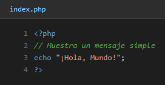

# UD1 - Mi primer programa en PHP

**Alumno:** Francisco Pérez Ruiz
**Asignatura:** Desarrollo Web en Entorno Servidor (DWES)

---

## Introducción

Este es el primer programa que hago en PHP. La idea es comprobar que el entorno está bien montado (XAMPP con Apache funcionando) y que el servidor es capaz de ejecutar un archivo PHP y devolverme el resultado en el navegador.

El programa es lo más simple posible: un `echo` que imprime "¡Hola, Mundo!". Pero detrás de eso ya pasa todo el proceso típico de PHP: el navegador hace una petición a `localhost`, Apache se la pasa al intérprete de PHP, el intérprete ejecuta el script y manda de vuelta el HTML resultante.

---

## Pasos que seguí

### 1. Crear la carpeta dentro de `htdocs`

Lo primero fue crear la carpeta del proyecto dentro del directorio de XAMPP, que es donde Apache busca los archivos que sirve:

`C:\xampp\htdocs\DWES_FranciscoPerez\UD1_Inicio\mi_primer_programa`

### 2. Escribir el código PHP

Dentro de esa carpeta creé un archivo `index.php` con tres líneas. El comentario es para acordarme de qué hace, y el `echo` es lo que se imprime en el navegador.

### 3. Probarlo en el navegador

En mi caso XAMPP corre en el puerto **8080**, así que la URL queda:

`http://localhost:8080/DWES_FranciscoPerez/UD1_Inicio/mi_primer_programa/index.php`

Y este es el resultado:

---

## Lo que aprendí

- Apache de XAMPP sirve por defecto la carpeta `htdocs`, así que todo lo que cuelgue de ahí se puede ver por `localhost`.
- Los archivos PHP tienen extensión `.php` y se ejecutan en el servidor, no en el navegador.
- `echo` es la forma más rápida de mostrar texto.
- Los bloques de código PHP van entre `<?php` y `?>`.
- Si me equivoco con el puerto o no tengo Apache arrancado, no carga la página (error de conexión). Si tengo un error de sintaxis en el PHP, sí carga pero muestra el mensaje de error.

Un ejercicio sencillo pero importante: confirma que el entorno está listo para empezar el resto de unidades.
