# Entrega 1

**Alumno:** Francisco Pérez Ruiz
**Asignatura:** Desarrollo Web en Entorno Servidor (DWES)

---

## Introducción

PHP es un lenguaje que se ejecuta en el servidor. Lo que hace, básicamente, es que cuando el navegador pide una página, el servidor corre el PHP y devuelve HTML. El navegador nunca ve el PHP, solo el HTML resultante. A mí me ayudó pensarlo como un "motor" que mete los datos dentro de la página antes de mandarla.

Esta primera entrega son los ejercicios introductorios del curso. Los temas que se tocan son la sintaxis básica, las variables, los arrays, las funciones, las clases, las cadenas y sus secuencias de escape, las constantes, las fechas y un primer contacto con las superglobales.

## Estructura de la entrega

Dentro de la carpeta `Entrega1` están los archivos `Programa1.php` hasta `Programa10_1.php`, este archivo `Entrega1.md` y la carpeta `image/Entrega1` con las capturas que aparecen aquí.

## Herramientas que uso

Para no estar recargando todo el rato uso la extensión Live Server, y AutoSave para guardar sin tener que pulsar Ctrl+S. Con Prettier y Mayús+Alt+F se indenta el PHP automáticamente, lo dejo apuntado porque al principio no lo conocía.

---

## Programa 1

Aquí se ve la sintaxis básica de PHP. Lo más importante que apunté:

- `echo` se usa para mostrar texto en el navegador.
- Los comentarios no se ejecutan (con `//` o `/* ... */`).
- Las variables siempre empiezan por `$`. Ejemplo: `$saludo = "¡Hola, Mundo!";`.
- Para los arrays se usan corchetes: `$colores = ["Rojo", "Verde", "Azul"];` y se accede con `$colores[0]`.
- Si una variable está declarada fuera de una función, dentro hay que poner `global` para poder usarla.
- Para concatenar texto se usa el punto `.`, no el `+` como en Java.

Bloque inicial con varios `echo` con colores y un comentario multilinea:

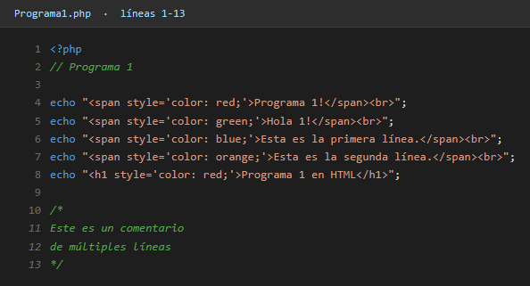

Después declaro variables simples y un array, y los muestro:

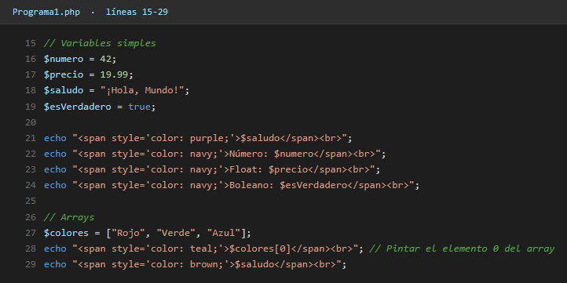

Aquí está la parte del ámbito de variables (usando `global` dentro de la función) y un pequeño contador:

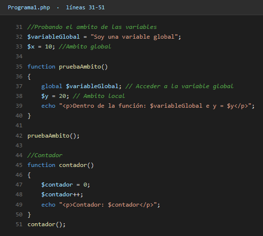

También probé a hacer una clase muy simple, `Coche`, con un constructor:

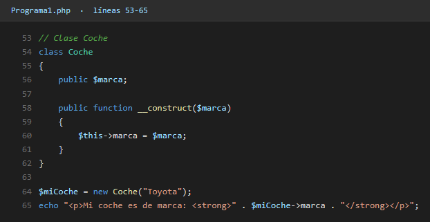

Y un bloque con concatenación y un `foreach` para recorrer un array de frutas:

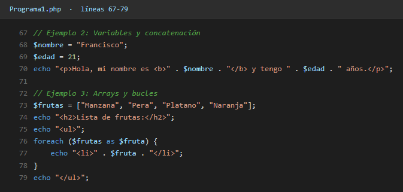

Por último, una función `sumar` y una clase `Persona` que tiene un método `saludar`:

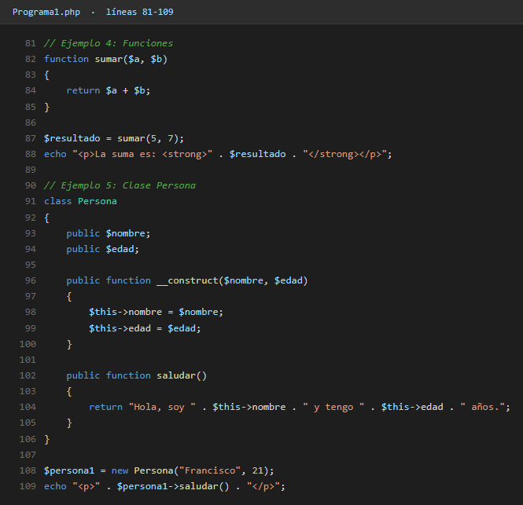

Salida en el navegador:

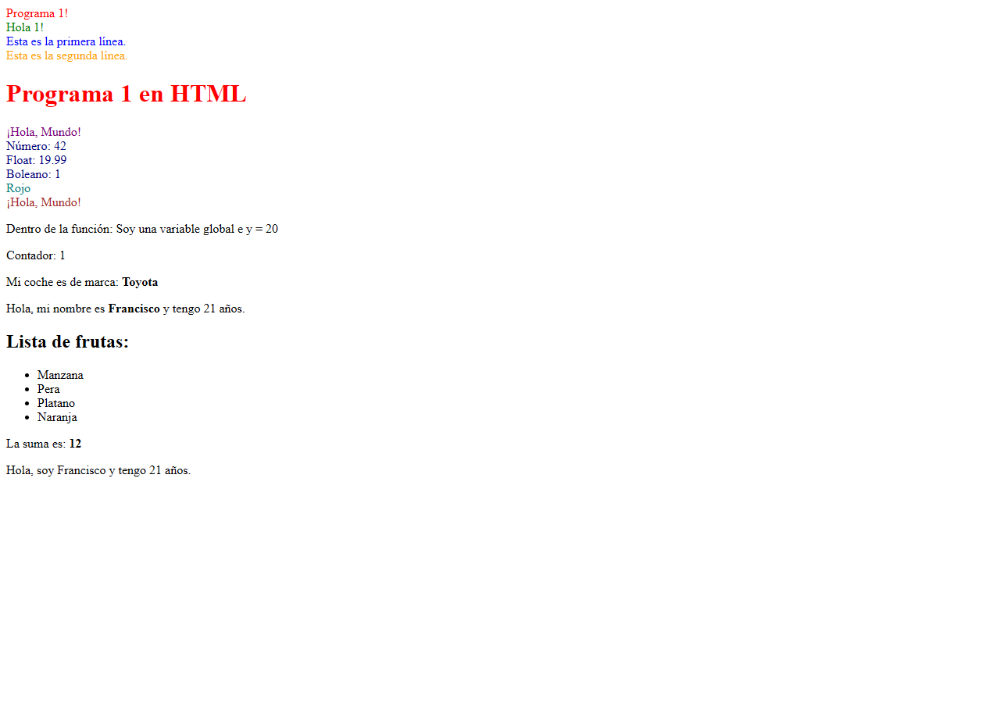

---

## Programa 2

Este programa es más corto. Es un HTML con bloques de PHP intercalados. Se declara mi nombre en una variable y se muestra dentro de un `<strong>`. Después se usa `printf` con dos `%s` para encajar el ciclo y el módulo dentro de la frase.

Primer bloque, donde creo la variable y la imprimo:

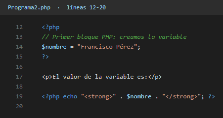

Segundo bloque, ya con `printf`:

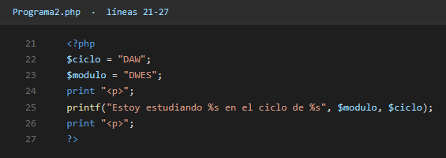

Salida en el navegador:

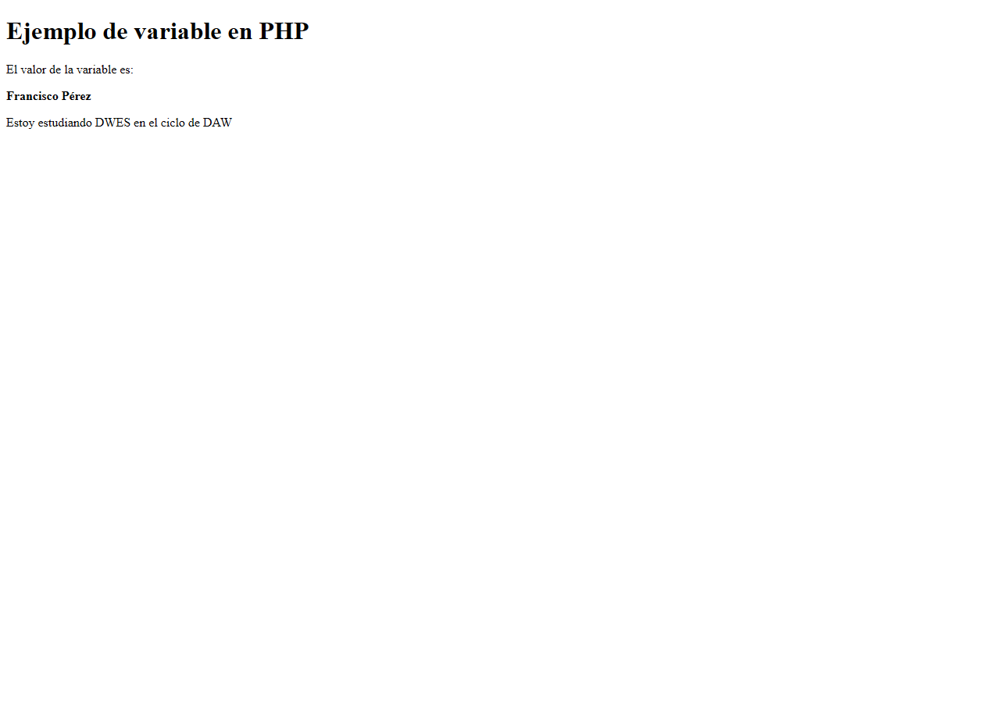

---

## Programa 3

Variables numéricas y de cadena para representar los datos de una empresa, todo dentro de un único `printf` que mezcla `%s`, `%d` y `%.2f`. Es básicamente el primer ejemplo "real" donde se ve para qué sirve `printf`.

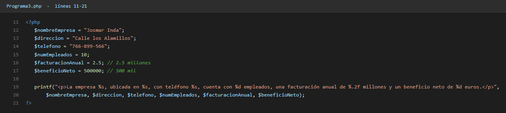

Salida:

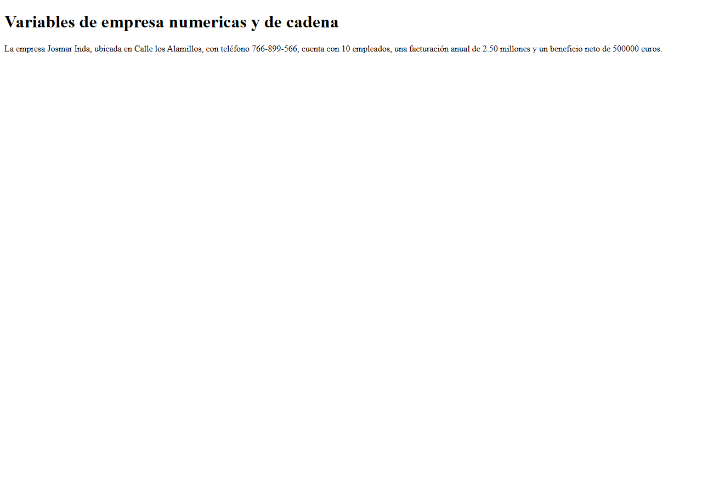

---

## Programa 4

Aquí se profundiza más con `printf` y `sprintf` aplicados a una aerolínea. La diferencia entre uno y otro es que `printf` imprime directamente y `sprintf` te devuelve la cadena ya formateada para que la uses cuando quieras.

Como referencia rápida me apunto esta tabla con los formatos:

| Formato  | Para qué sirve          | Ejemplo                             | Resultado            |
| -------- | ------------------------ | ----------------------------------- | -------------------- |
| `%s`   | Texto (string)           | `printf("Hola %s", "Francisco");` | `Hola Francisco`   |
| `%d`   | Entero                   | `printf("Edad: %d", 21);`         | `Edad: 21`         |
| `%f`   | Decimal (float)          | `printf("Precio: %f", 3.5);`      | `Precio: 3.500000` |
| `%.2f` | Decimal con 2 decimales  | `printf("Precio: %.2f", 3.5);`    | `Precio: 3.50`     |
| `%b`   | Binario                  | `printf("%b", 5);`                | `101`              |
| `%o`   | Octal                    | `printf("%o", 9);`                | `11`               |
| `%x`   | Hexadecimal (minúscula) | `printf("%x", 255);`              | `ff`               |
| `%X`   | Hexadecimal (mayúscula) | `printf("%X", 255);`              | `FF`               |
| `%c`   | Carácter ASCII          | `printf("%c", 65);`               | `A`                |

Bloque con `printf`:

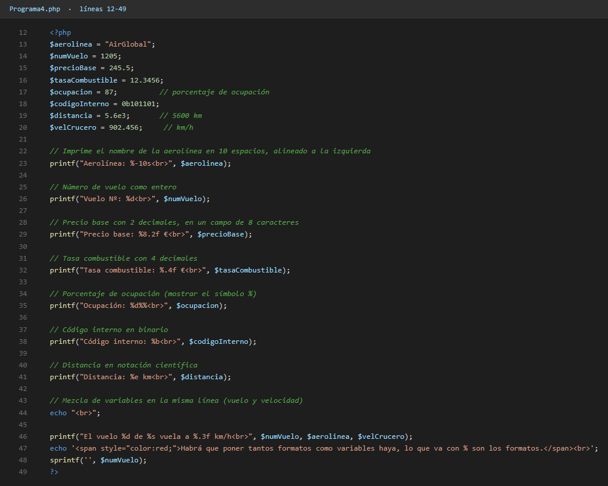

Bloque con `sprintf` (se guarda en `$mensaje` y luego se imprime con `echo`):

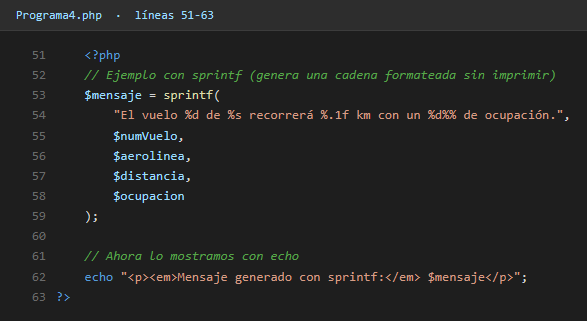

Salida:

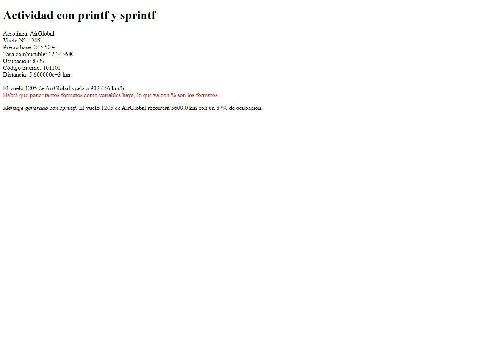

---

## Programa 5

Trata sobre cómo se comportan las cadenas en PHP. Lo importante:

- Las comillas dobles interpretan secuencias de escape (`\n`, `\t`...) y también las variables que metas dentro.
- Las comillas simples no interpretan nada salvo `\'` y `\\`.
- Se pueden meter códigos Unicode (`\u{2708}`) y hexadecimales (`\x41`).
- `heredoc` es como las dobles pero para texto multilínea, y `nowdoc` es como las simples pero también multilínea.

Primer bloque, con comillas dobles, simples y los códigos:

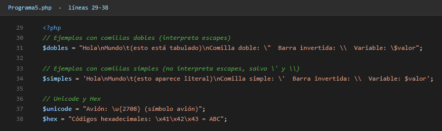

Segundo bloque, con heredoc y nowdoc:

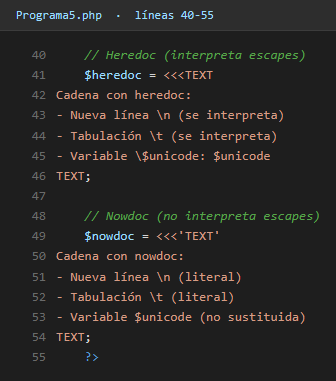

Salida:

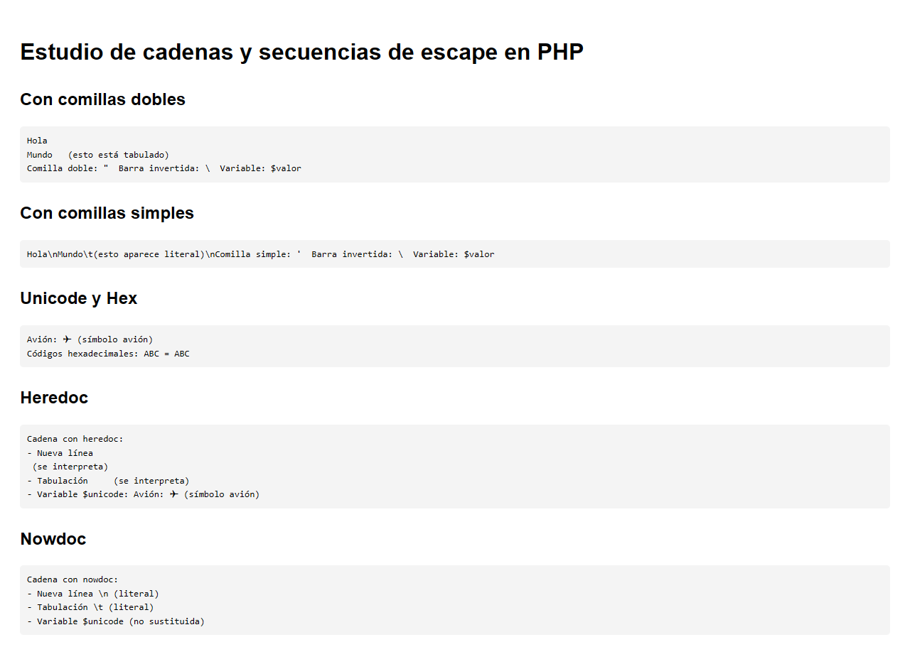

---

## Programa 6

Aquí trabajamos con tipos. Las funciones que me hicieron falta fueron `gettype` para ver el tipo, `settype` para forzarlo, `is_string` / `is_array` / etc. para comprobar, `isset` para saber si la variable existe y `unset` para borrarla.

Una cosa importante: las constantes **no llevan `$`** delante.

Bloque de declaración y `gettype`:

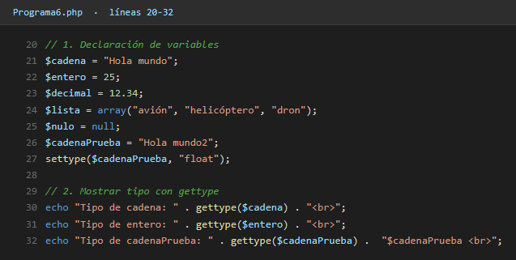

Comprobaciones con `is_*` y conversión con `settype`:

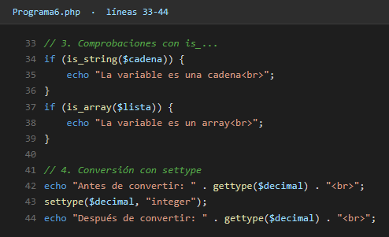

`isset` y `unset` para comprobar y borrar la variable:

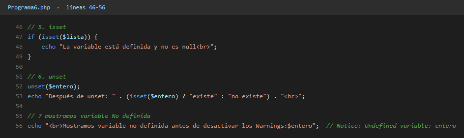

Si al final del programa intento imprimir una variable que ya no existe, sale un Warning. Eso se puede ocultar con `error_reporting(0)` o desde el `php.ini`:

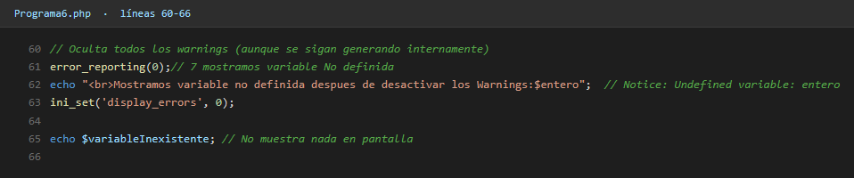

Salida:

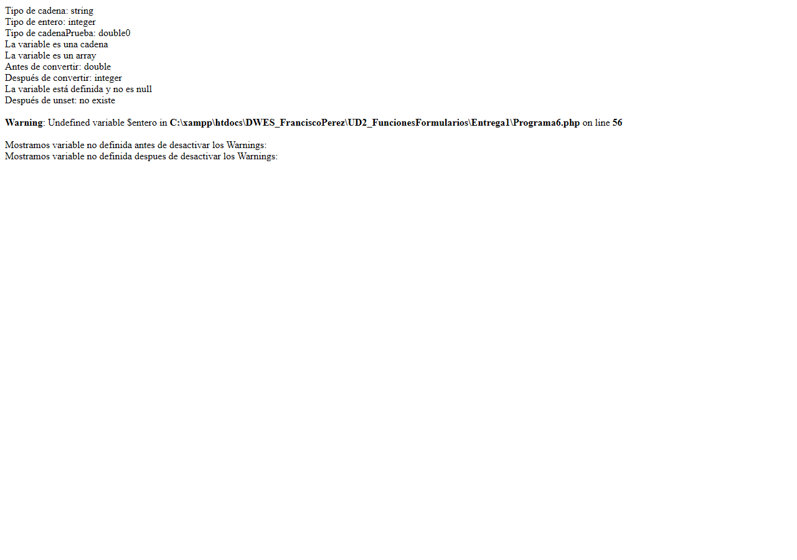

---

## Programa 7

Constantes con `define` y con `const`. Parecen lo mismo pero no lo son:

- `define()` se ejecuta en tiempo de ejecución, por eso se puede meter dentro de un `if`.
- `const` se evalúa en tiempo de compilación, no admite expresiones complicadas ni vivir dentro de un `if`.

Bloque con `define`:

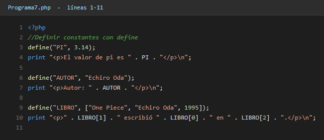

Bloque con `const`:

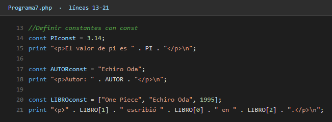

Reasignaciones y `count(get_defined_constants())` para ver cuántas hay definidas:

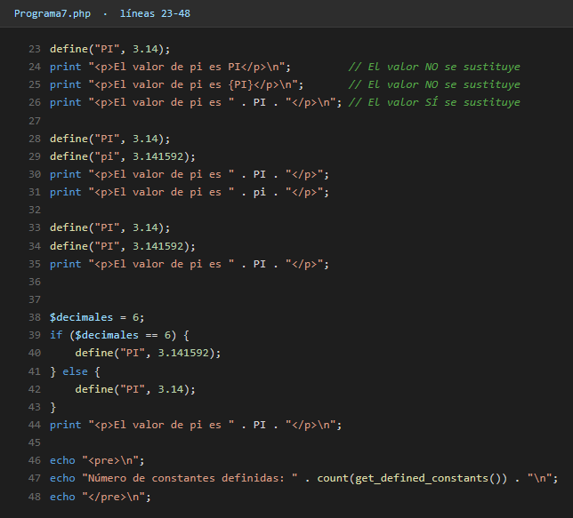

Y al final hay un bloque que está comentado porque, si se ejecuta, da Fatal Error: usar `const` dentro de un `if` o asignarle una variable. Lo dejo para acordarme:

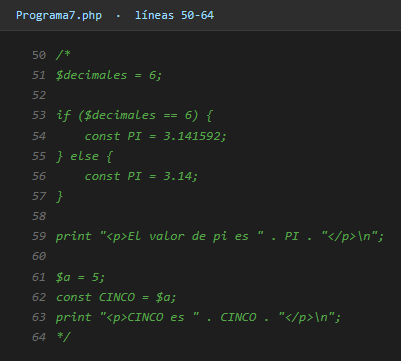

Salida:

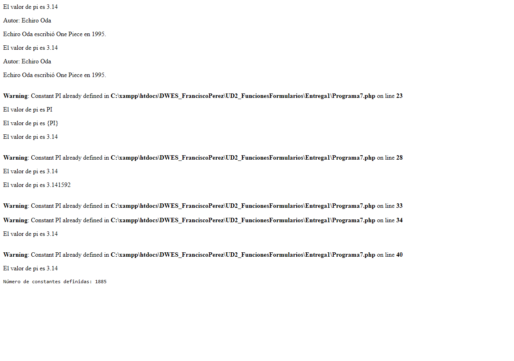

---

## Programa 8

Es una mezcla de PHP y HTML. La parte de PHP define unas constantes (deporte, equipo, estadio, aforo) y unas variables de ejemplo. Después, ya en HTML, se usan tablas con `<?= ... ?>` para volcar las constantes y comprobar su tipo con `gettype`, `is_string` y `is_int`.

Parte PHP:

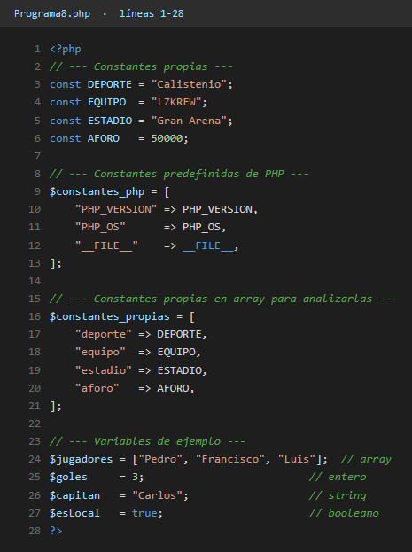

Parte HTML con las tablas:

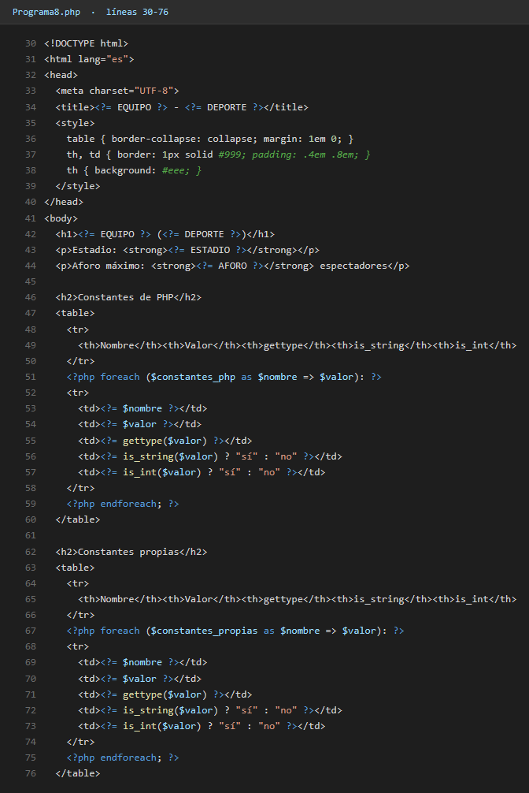

Salida:

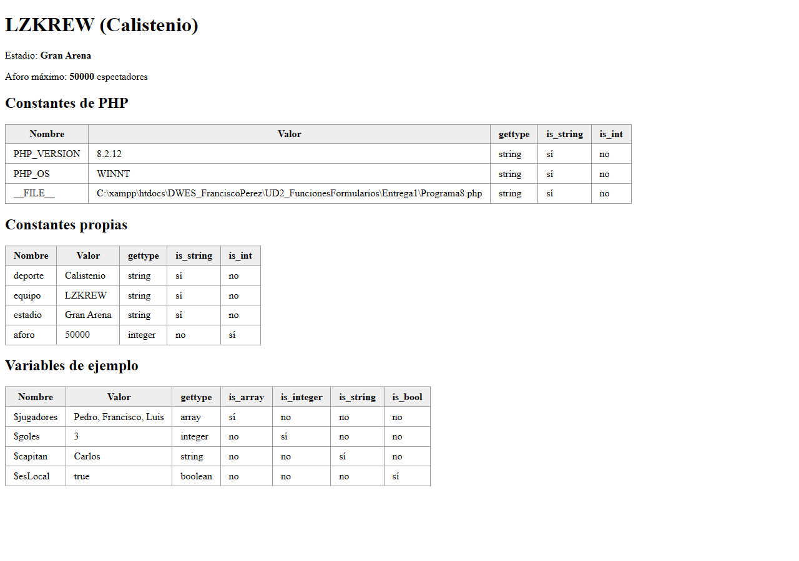

---

## Programa 9

Cómo mostrar la fecha y la hora con `date()`. Cambiando las letras del formato se sacan combinaciones distintas. Por ejemplo, `d/m/Y H:i:s` me da la fecha y hora completas. Algunas que aprendí:

- `l` para el nombre del día de la semana.
- `F` para el mes en texto.
- `W` para la semana del año.
- `z` para el día del año.
- `A` para AM/PM.

Primer bloque (fecha y hora normales, día y mes):

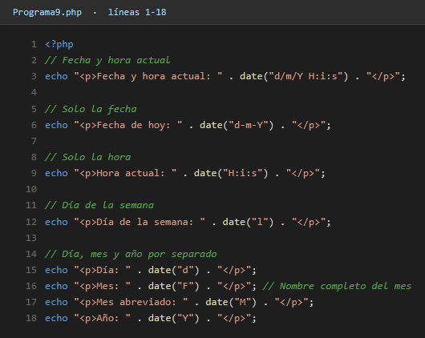

Segundo bloque (semana del año, día del año, AM/PM y timestamp):

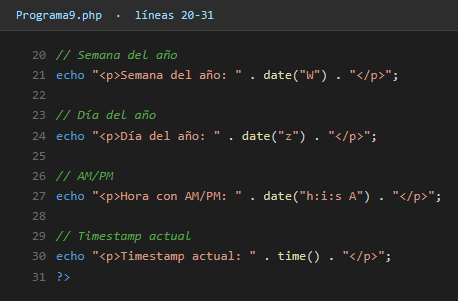

Salida:

---

## Programa 10

Primer contacto con las superglobales y las constantes predefinidas.

Las superglobales que vimos aquí son `$_SERVER`, que tiene info del servidor y la petición, y `$_GET`, que recoge los parámetros pasados por la URL. Con el operador `??` se puede dar un valor por defecto si la clave no existe.

Las constantes predefinidas más útiles son `PHP_VERSION`, `PHP_OS`, `PHP_INT_MAX` y `DIRECTORY_SEPARATOR`.

Acceso a `$_SERVER` y `$_GET`:

Acceso a las constantes predefinidas:

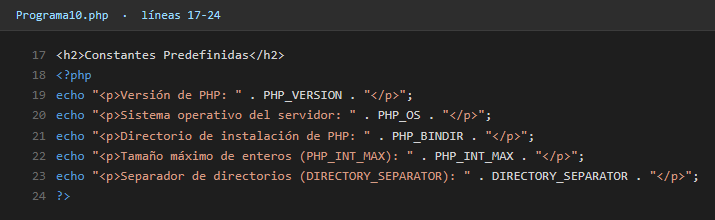

Salida:

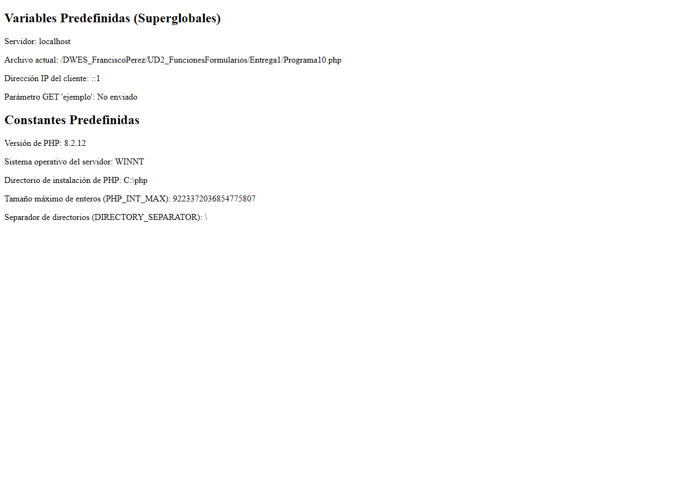

---

## Programa 10_1

Versión ampliada del anterior. Aquí se imprimen prácticamente todas las superglobales una detrás de otra: `$_SERVER`, `$_GET`, `$_POST`, `$_REQUEST`, `$_FILES`, `$_ENV`, `$_GLOBALS`, `$_COOKIE` y `$_SESSION`. Sirve como "panel de control" para entender qué contiene cada una. También tiene dos formularios, uno GET y otro POST, para ver cómo cambian las superglobales según el método.

Primera parte (`$_SERVER`, `$_GET` y `$_POST`):

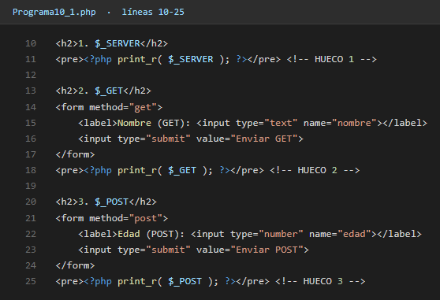

Segunda parte (resto de superglobales):

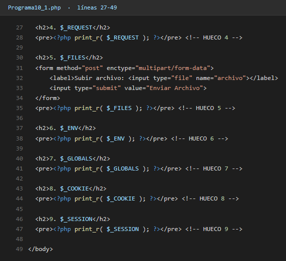

Salida:

---

## Conclusiones de la entrega

Lo más importante que me llevo de esta primera entrega:

- Con `echo` y `printf` cubro casi cualquier salida de texto.
- Las funciones de tipos (`gettype`, `settype`, `isset`, `unset`) son básicas para no quedarme bloqueado cuando salgan Warnings raros.
- `define` y `const` no son intercambiables aunque lo parezcan.
- Las superglobales son el puente entre el navegador y mi código PHP.

Como nota personal: el Programa 6 fue el que más me hizo entender por qué hay errores tan típicos cuando se trabaja con variables sin comprobar. Vale la pena invertir tiempo aquí antes de seguir.
