# Entrega 2

**Alumno:** Francisco Pérez Ruiz
**Asignatura:** Desarrollo Web en Entorno Servidor (DWES)

---

## Introducción

Esta segunda entrega ya da el salto a las estructuras de control y a los formularios, que es donde PHP empieza a tener sentido de verdad. En la primera entrega aprendimos a "imprimir cosas", pero aquí ya hay decisiones (`if`, `switch`, `match`), bucles, funciones reutilizables, arrays más serios y formularios que reciben datos del usuario.

Los programas van del 11 al 34, y se pueden agrupar más o menos así:

- Decisiones (11, 12, 13): `if/else`, `switch`, `match`.
- Bucles (14, 15): `for`, `while`, `do/while`, `foreach`.
- Funciones (16, 17, 18, 19): declaración, argumentos, referencias, `include`/`require`.
- Funciones útiles (20): cadenas, fechas, números y arrays.
- Arrays (21, 22, 23, 24): asociativos, bidimensionales, punteros internos y CRUD.
- Formularios (25, 26, 27, 28, 29): `$_POST`, `$_GET`, `$_REQUEST` y validación.
- Inputs (30, 31, 32, 33): login, radios, checkboxes y select.
- Validación de email (34).

---

## Programa 11

Sentencias condicionales `if`, `else` y `elseif`. Hay dos ejemplos en el archivo.

El primer ejemplo crea un usuario y una edad, y comprueba si es mayor o menor de edad:

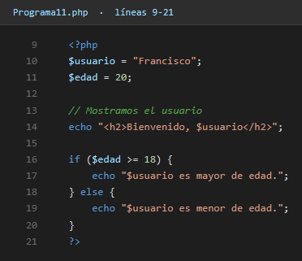

El segundo ejemplo compara dos variables `a` y `b` con `if`, `else if` y `else`:

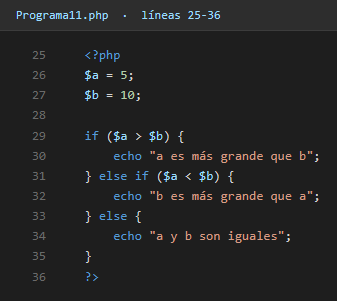

Salida:

---

## Programa 12

Sentencia `switch` con un caso muy básico: según el valor de `$dia`, imprime un día de la semana. El detalle importante es el `break`: si se te olvida, los casos siguientes también se ejecutan.

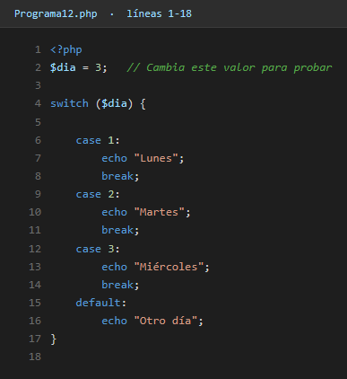

Salida:

---

## Programa 13

Expresión `match`, que es la versión moderna del `switch`. La diferencia es que `match` devuelve un valor que se puede asignar a una variable, es estricto en tipos (`===`) y no hace falta `break`.

Primer ejemplo, con un videojuego que se clasifica según su género:

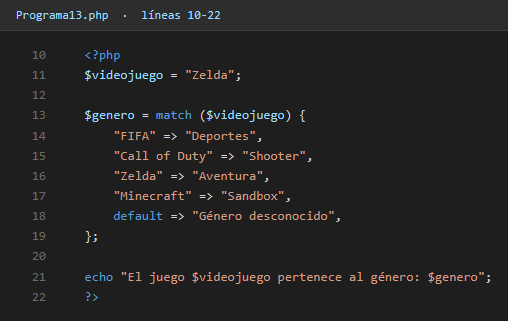

Segundo ejemplo, con un usuario y un rol, donde el mensaje cambia según el rol:

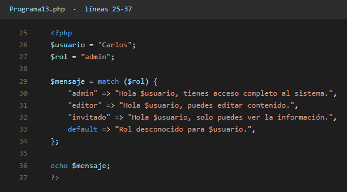

Tercer ejemplo, donde el resultado del `match` se guarda en `$return_value`:

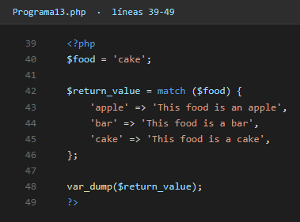

Salida:

---

## Programa 14

Los tres bucles principales: `for`, `while` y `do...while`. El truco para saber cuál usar:

- `for` cuando sabes cuántas veces vas a iterar.
- `while` cuando iteras mientras se cumpla una condición.
- `do...while` cuando quieres que se ejecute al menos una vez, aunque la condición sea falsa desde el principio.

Ejemplo con `for`:

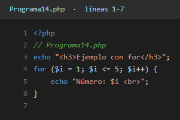

Ejemplo con `while`:

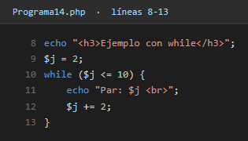

Ejemplo con `do...while`:

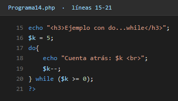

Salida:

---

## Programa 15

`foreach` aplicado a varios casos. Lo bueno de `foreach` es que no tienes que llevar tú el índice, y si pones `as $clave => $valor` te da las dos cosas a la vez.

Recorrido simple y formato clave => valor:

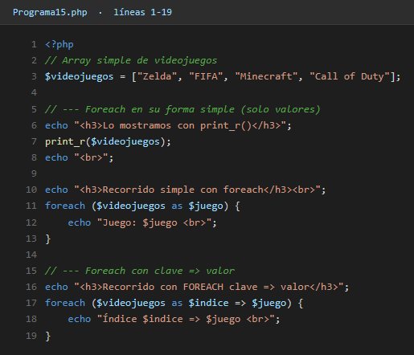

Matriz bidimensional (un array de arrays asociativos con `nombre` y `genero`):

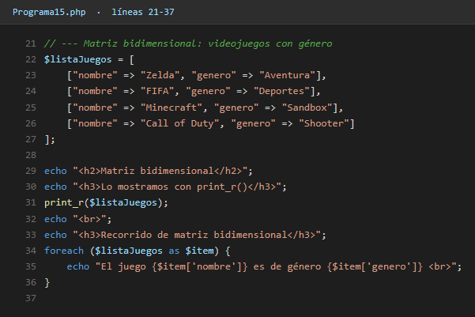

Último bloque, recorriendo `$_SERVER` con `foreach`:

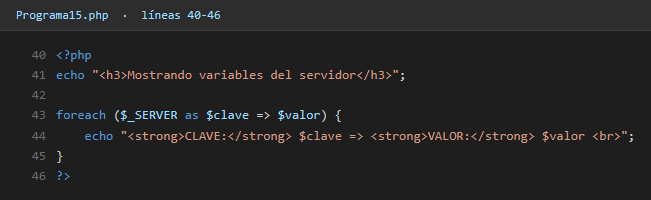

Salida:

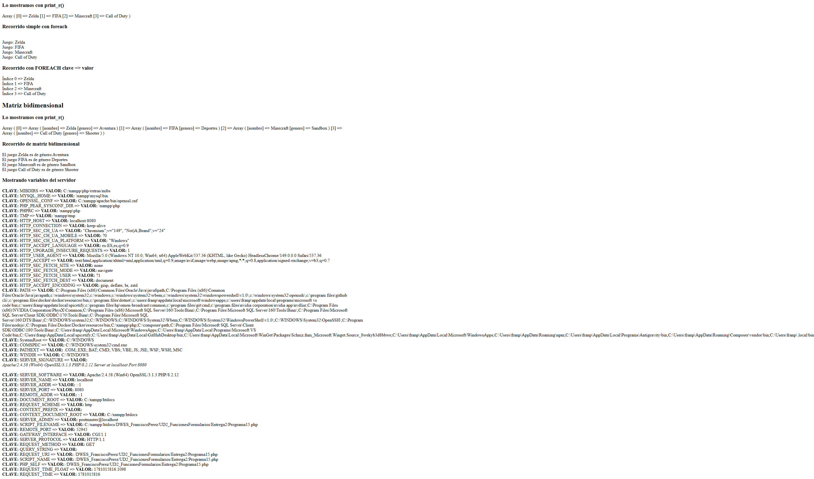

---

## Programa 16

Cómo declarar funciones. Hay dos casos en el archivo.

Función simple sin argumentos, que calcula el precio con IVA usando valores fijos:

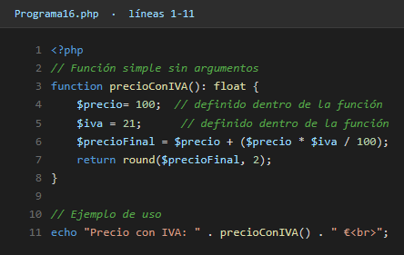

Función condicional: solo se define si se cumple un `if`. Por dentro usa `global` para acceder a una variable externa:

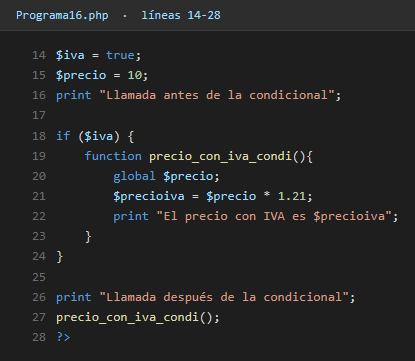

Salida:

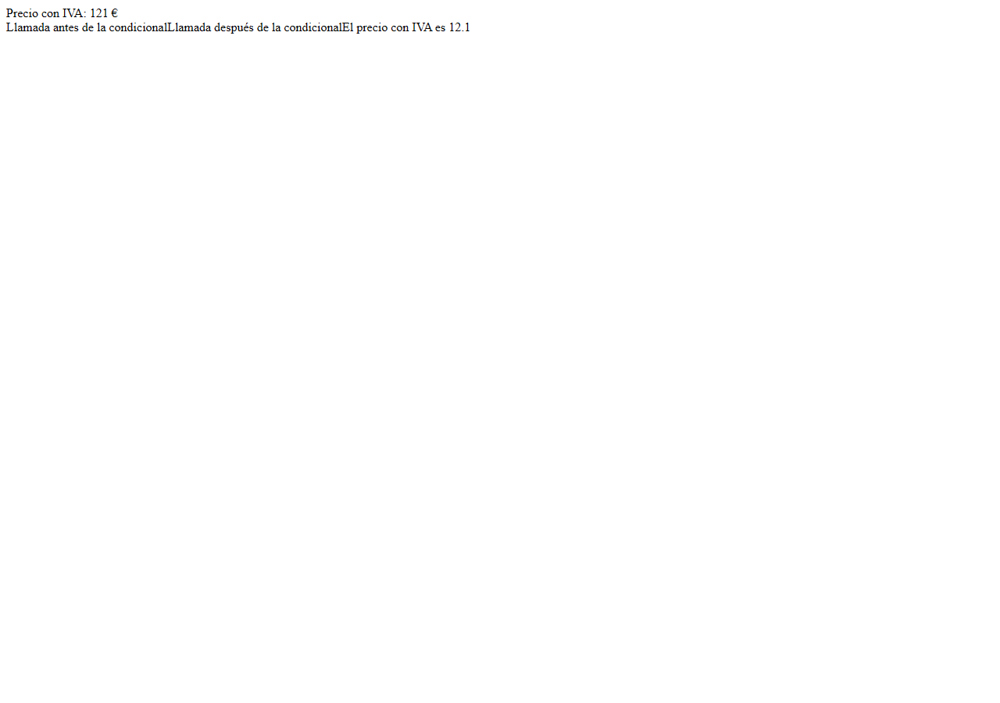

---

## Programa 17

Misma función `precioConIVA` pero ya con argumentos tipados (`float $precio`, `float $iva`). El tipado en PHP es opcional pero ayuda a leer el código y a evitar errores tontos.

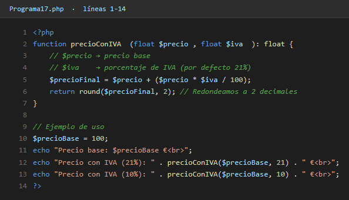

Salida:

---

## Programa 18

Argumentos por referencia con `&`. La diferencia con el paso por valor es que aquí no se pasa una copia, sino la dirección de memoria, así que si la función cambia la variable, también cambia fuera.

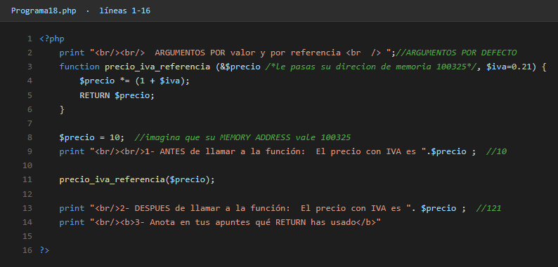

Salida:

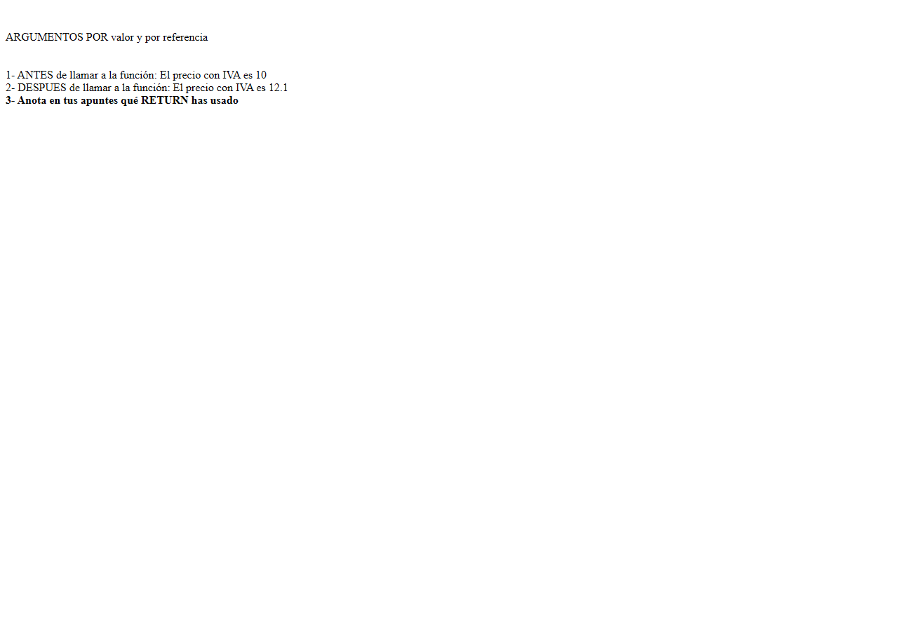

---

## Programa 19

`include`, `require`, `include_once` y `require_once`. Sirven para reutilizar código de otros archivos.

| Comando          | Si el fichero falla   | Se puede incluir varias veces |
| ---------------- | --------------------- | ----------------------------- |
| `include`      | Solo avisa, sigue.    | Sí.                          |
| `require`      | Fatal error, se para. | Sí.                          |
| `include_once` | Solo avisa.           | No, solo una vez.             |
| `require_once` | Fatal error.          | No, solo una vez.             |

Primero se declara `funciones.php`, que tiene `saludar`, `despedir`, `multiplicar` y `dividir`:

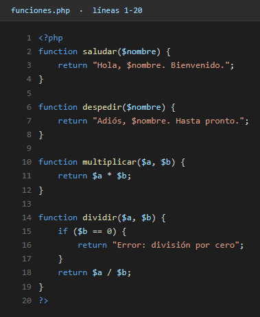

Programa 19A, que usa `include`:

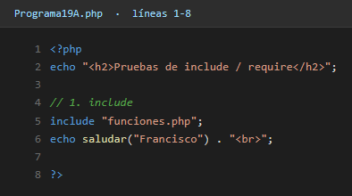

Programa 19B, que usa `require`:

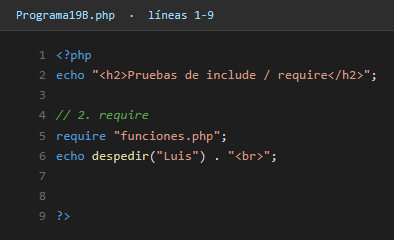

Programa 19C, que usa `include_once` dos veces (la segunda se ignora):

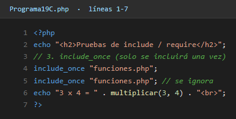

Resultados en el navegador:

---

## Programa 20

Recopilación de funciones útiles de PHP que es importante conocer:

- `strlen()` para la longitud de una cadena.
- `strtoupper()` y `strtolower()` para mayúsculas y minúsculas.
- `substr()` para extraer parte de una cadena.
- `date()` para la fecha y hora.
- `number_format()` para formatear números con separadores.
- `rand()` para un número aleatorio en un rango.
- `array_sum()` para sumar valores de un array.
- `in_array()` para comprobar si un valor está en un array.
- `implode()` para convertir un array en una cadena.

Primer bloque (cadenas, fechas y números):

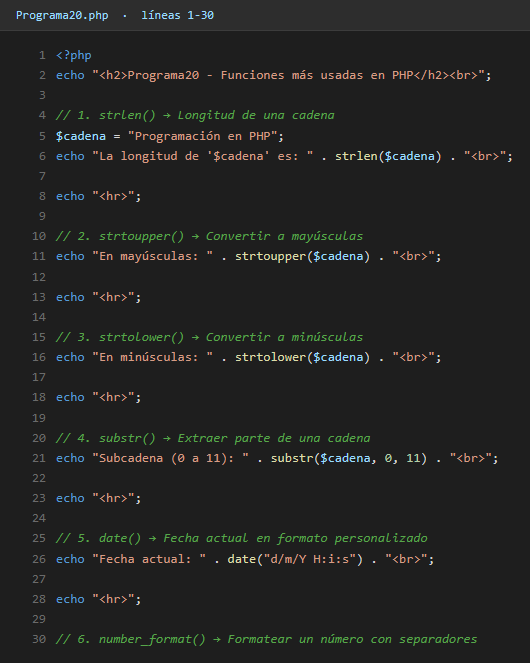

Segundo bloque (aleatorios y arrays):

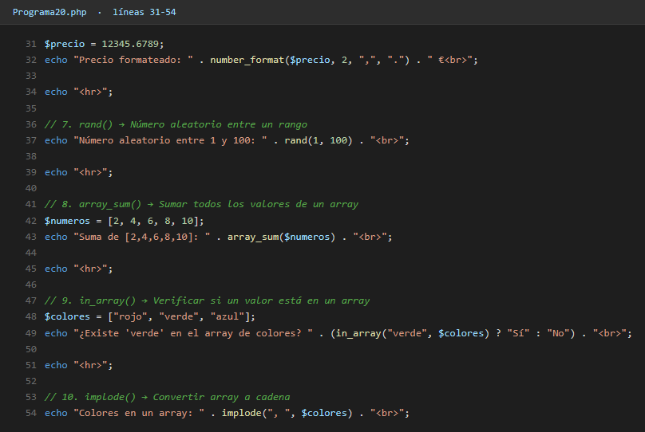

Salida:

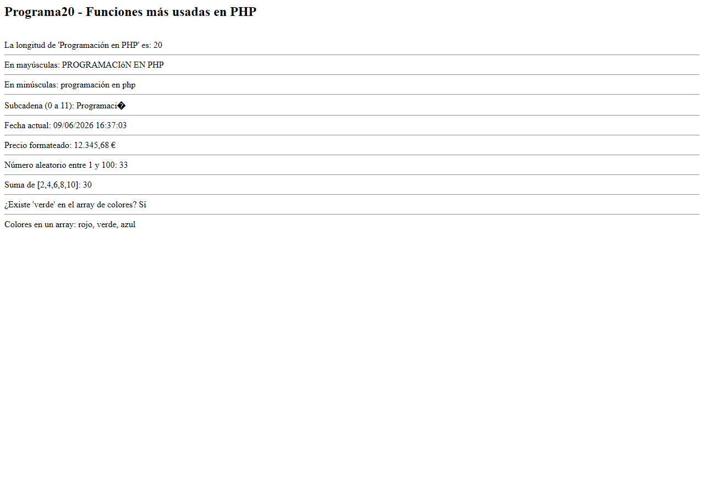

---

## Programa 21

Arrays asociativos. Se ve cómo se pueden declarar de dos formas, con `array(...)` y con `[...]`, y también cómo construir un array paso a paso (con índice explícito o sin él).

Definición de `$array1` y `$array2`:

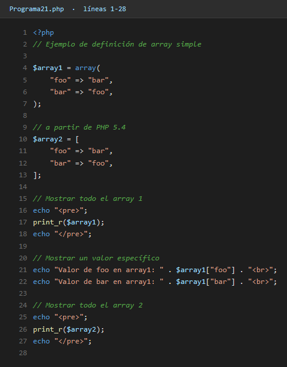

Arrays paso a paso (`$modulos1` con índices, `$modulos2` sin índice):

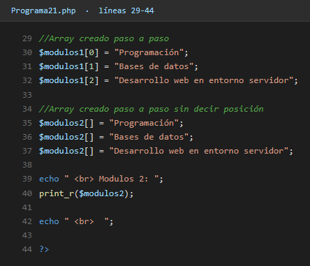

Salida:

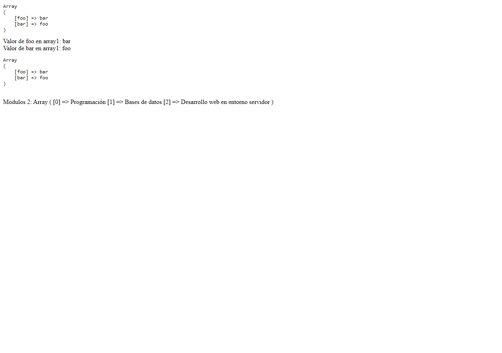

---

## Programa 22

Recorrer arrays. Aquí hay un array numérico (`$modulos1`) y uno asociativo bidimensional (`$ciclos`, con DAW y DAM dentro). Para el numérico se usa un `for`, y para el bidimensional un `foreach` anidado.

Array numérico con `for`:

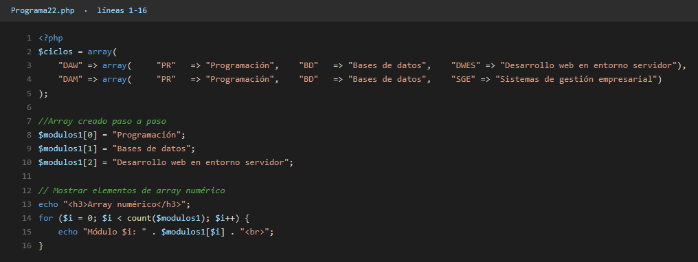

Array asociativo bidimensional con `foreach` anidado:

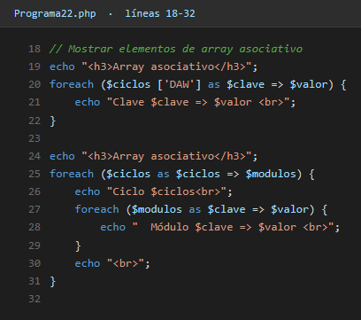

Salida:

---

## Programa 23

Funciones para mover el puntero interno de un array: `reset()`, `next()`, `prev()`, `end()` y `key()`. Cada array tiene un cursor invisible, y estas funciones lo mueven.

Movimiento normal del puntero (al primero, siguiente, anterior y último):

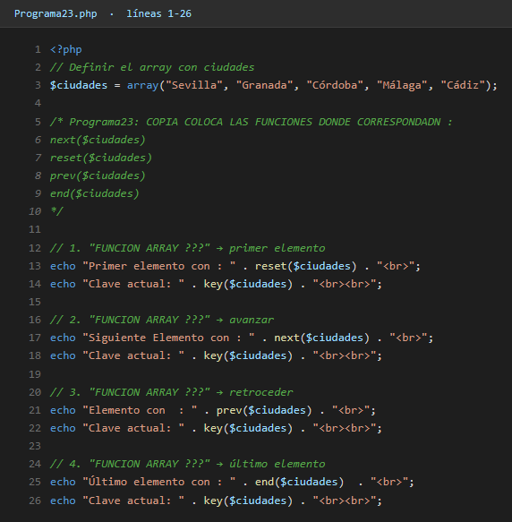

Qué pasa cuando se llama a `next()` después del último elemento (la clave actual pasa a ser `null`):

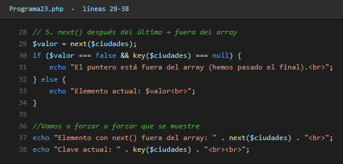

Salida:

---

## Programa 24

Mini-CRUD sobre un array. El array es un concesionario de coches y hay que:

- Añadir un coche nuevo.
- Modificar uno existente.
- Eliminar otro con `unset()`.
- Reindexar si era un array numérico (con `array_values()`).
- Comprobar si una variable es array (`is_array()`), contar (`count()`), buscar valores (`in_array()`, `array_search()`) y claves (`array_key_exists()`).
- Mostrar el array final con `print_r()`.

Primer bloque (añadir, modificar, eliminar y reindexar):

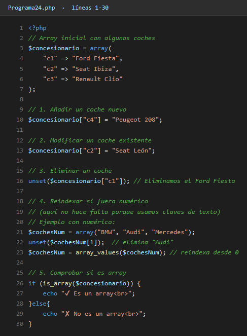

Segundo bloque (búsquedas y claves):

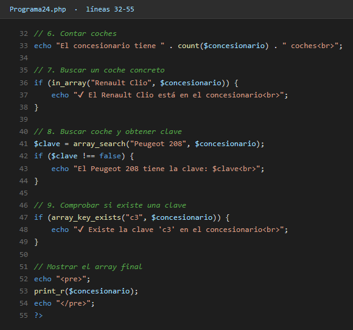

Salida:

---

## Programa 25

Primer formulario con POST. El formulario tiene tres campos: nombre, email y mensaje. Cuando se envía, va a `accion.php` que comprueba que la petición sea POST y muestra los datos.

Detalles importantes que apunté:

- Hay que comprobar el método con `$_SERVER["REQUEST_METHOD"] === "POST"`.
- Conviene usar `htmlspecialchars()` para evitar que se inyecte HTML.
- Para los textos con saltos de línea, `nl2br()` los convierte en ` `.

Código del formulario `form.html`:

Código del procesador `accion.php`:

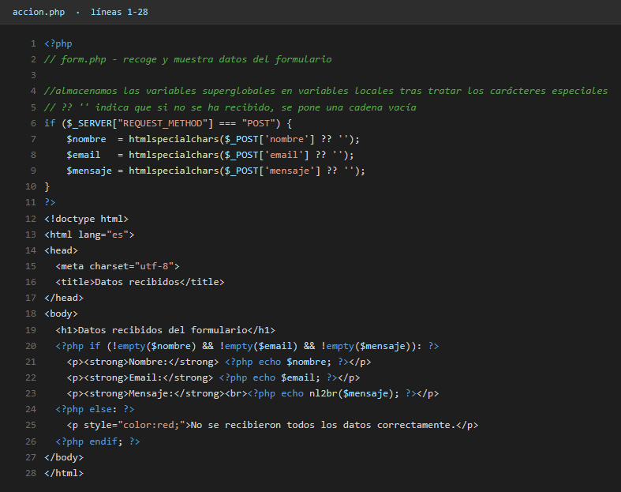

Formulario en el navegador:

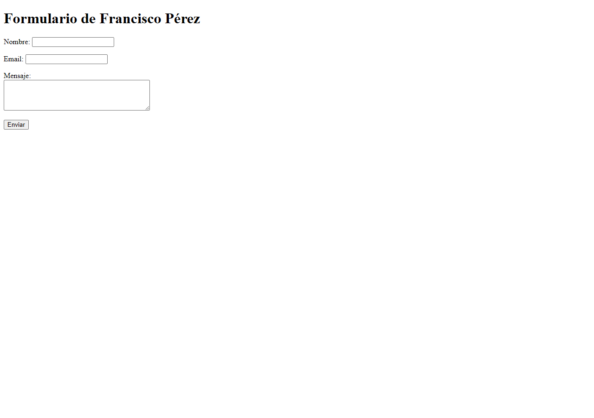

---

## Programa 26

Formulario con checkboxes. Lo nuevo es que si en el `name` del input se pone `name="modulos[]"`, PHP lo recibe como un array. En el procesador se recoge con `$_POST['modulos']` y se recorre con `foreach`.

Código del formulario:

Código del procesador con `$_POST`:

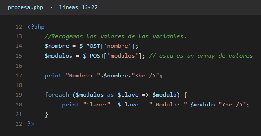

Formulario en el navegador:

---

## Programa 27

Demuestra qué hace `$_REQUEST`. Esta superglobal recoge datos de GET, POST y COOKIE a la vez. Es cómoda pero no se recomienda usarla en producción porque mezcla orígenes y es peor para la seguridad. Lo correcto es usar `$_GET` o `$_POST` según el método del formulario.

Aquí el formulario manda los datos por GET, pero el procesador usa `$_POST` para el nombre (a propósito da error) y `$_REQUEST` para los módulos (sí funciona).

Código del formulario con `method="GET"`:

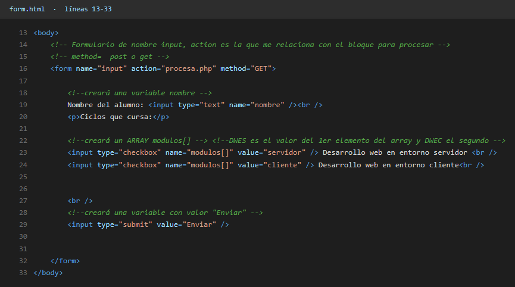

Código del procesador, mezclando `$_POST` y `$_REQUEST`:

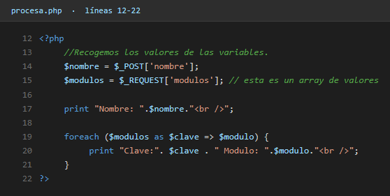

Formulario en el navegador:

---

## Programa 28

Cómo mantener los valores del formulario después de enviarlo. Aquí se usan varios trucos:

- `empty()` para comprobar si un campo está vacío.
- `value="<?= ... ?>"` para meter en el `value` del input el dato que ya envió el usuario.
- `checked` en los checkboxes según si el valor está dentro del array enviado (`in_array(...)`).

Procesado POST y comprobación de aficiones:

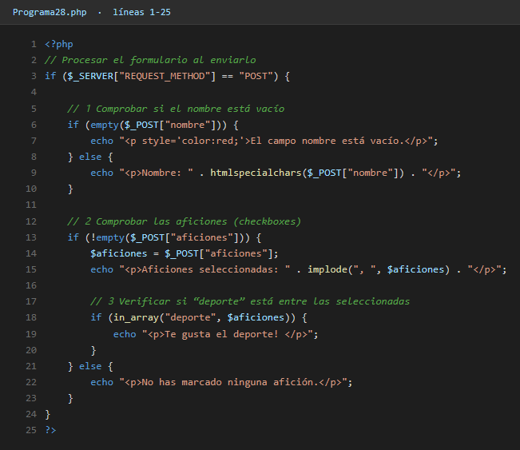

Formulario que recuerda los valores enviados:

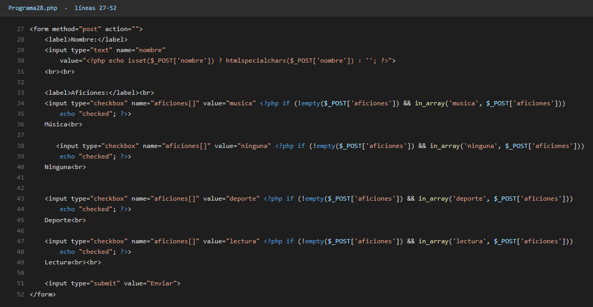

Salida:

---

## Programa 29

Formulario más completo, con varias comprobaciones a la vez. Comprueba que el nombre no esté vacío, que se haya marcado al menos un módulo, y si no es así muestra el error en rojo. Además, mantiene los valores ya escritos para que el usuario no tenga que volver a teclear.

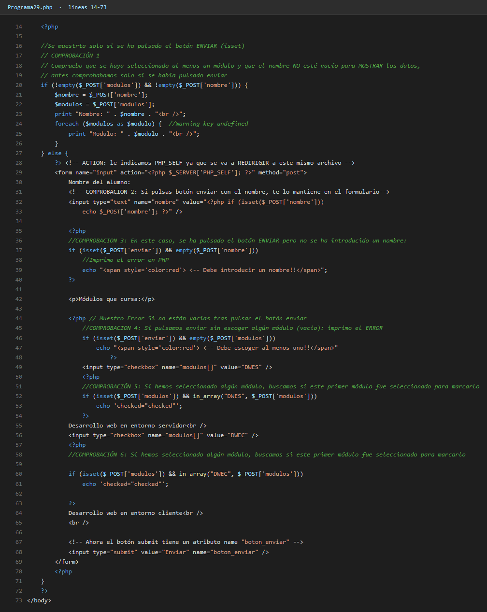

Salida:

---

## Programa 30

Formulario de login con usuario y contraseña. Es solo educativo: nunca se debe almacenar ni mostrar una contraseña en claro. En la vida real se usa `password_hash` y `password_verify`, pero eso lo veremos más adelante.

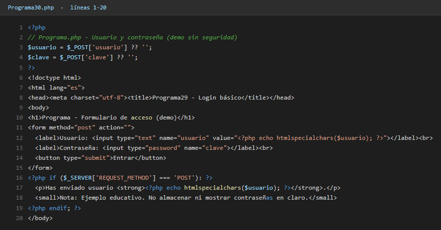

Salida:

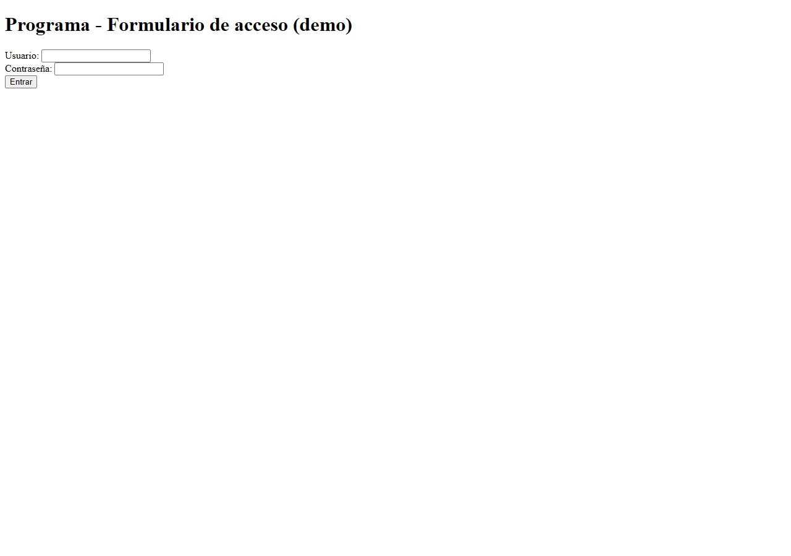

---

## Programa 31

Formulario con radio buttons para elegir un turno (mañana, tarde o noche). Como son `radio`, solo se puede seleccionar uno. Después de enviar, el `checked` se mantiene en el que se haya elegido.

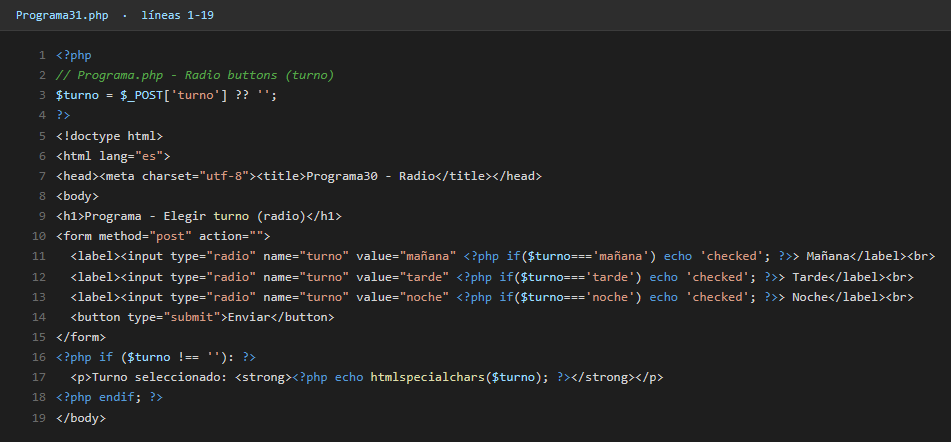

Salida:

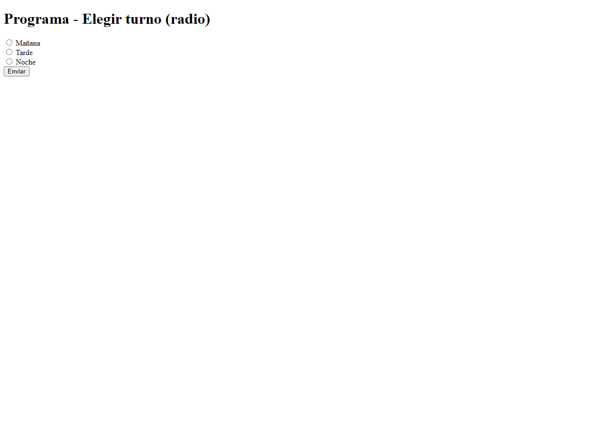

---

## Programa 32

Formulario con checkboxes para elegir aficiones (música, deporte, lectura, cine, viajes). Aquí sí se pueden marcar varias, y PHP las recibe como un array porque el `name` es `aficiones[]`.

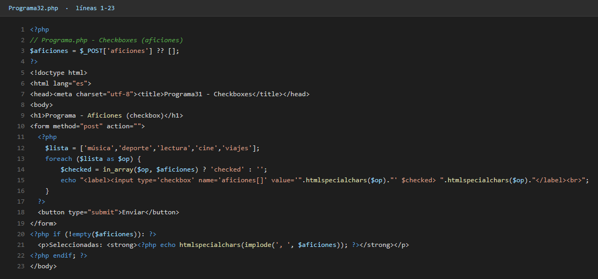

Salida:

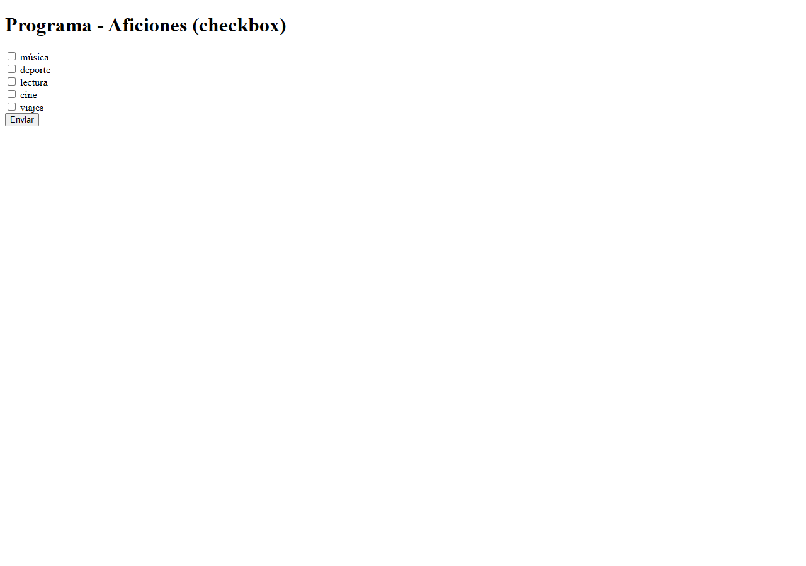

---

## Programa 33

Formulario con un `select` para elegir un país de una lista (España, Francia, Italia, Alemania, Portugal). Las opciones se imprimen con un `foreach` y se mantiene el `selected` en la opción que ya se haya elegido.

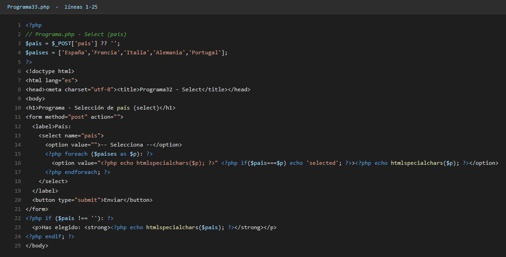

Salida:

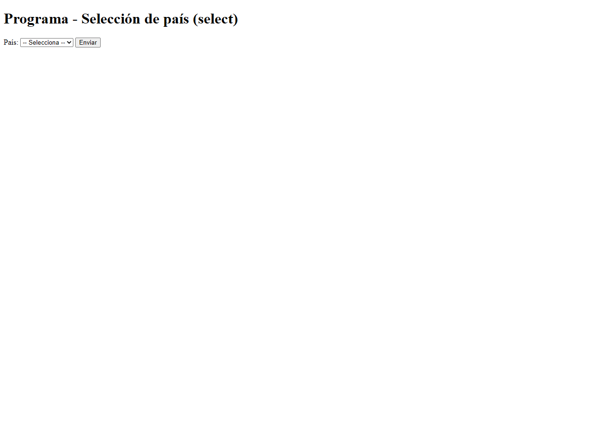

---

## Programa 34

Validación de email con `filter_var($email, FILTER_VALIDATE_EMAIL)`. Comprueba dos cosas: que el campo no esté vacío y que el formato sea correcto. Si falla, mete los errores en un array `$errores` y los pinta en rojo. Si todo está bien, muestra un mensaje de confirmación.

Lógica de validación:

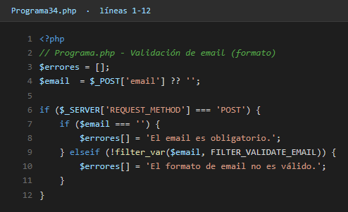

Formulario con los mensajes de error y confirmación:

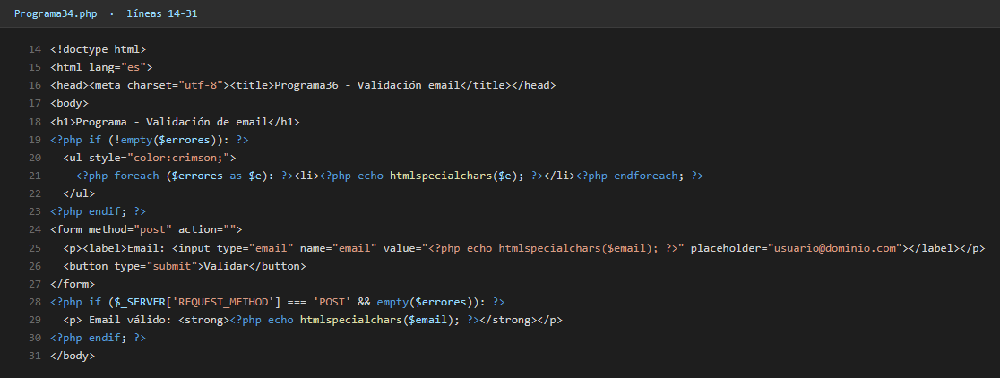

Salida:

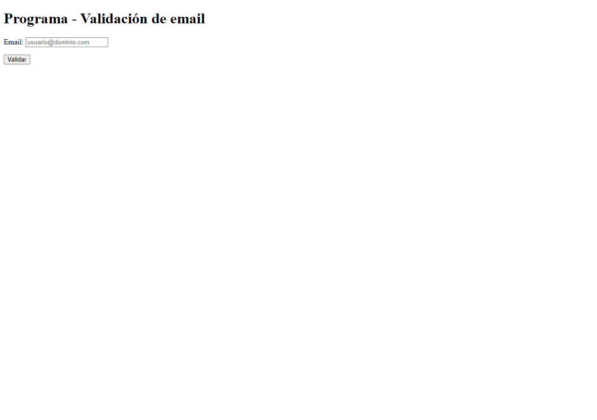

---

## Conclusiones de la entrega

Lo que me llevo de esta segunda parte:

- `match` me parece mucho más limpio que `switch`, lo voy a usar siempre que pueda.
- `foreach` es probablemente el bucle que más voy a usar.
- Separar las funciones en un `funciones.php` y reutilizarlas con `require_once` es una costumbre que conviene coger pronto.
- Los formularios siempre se validan, sin excepciones. No se puede confiar en lo que envía el usuario.
- `$_REQUEST` no se debe usar a la ligera; mejor `$_GET` o `$_POST` según el caso.
- Para autenticación, nunca contraseñas en claro.

La parte de formularios es la que más se va a usar en proyectos reales, así que es importante tenerla bien clara antes de seguir.
