# UD3 - Programación Orientada a Objetos en PHP

**Alumno:** Francisco Pérez Ruiz
**Asignatura:** Desarrollo Web en Entorno Servidor (DWES)

---

## Introducción

En esta unidad damos el salto al paradigma de la **programación orientada a objetos** en PHP. Hasta ahora todo lo que veníamos haciendo era código procedural (funciones sueltas, scripts cortos). Con POO, en cambio, organizamos el código en **clases** que tienen propiedades y métodos, y creamos **objetos** (instancias) que usan esas clases.

La POO se basa en cuatro pilares: **abstracción**, **encapsulamiento**, **herencia** y **polimorfismo**. A lo largo de los programas vamos pasando por todos ellos, además de tocar temas más avanzados como traits, interfaces, namespaces, autoload y algunas estructuras de datos de la SPL.

Una ventaja real de trabajar así es separar la lógica de negocio de la presentación. Eso facilita el mantenimiento, la reutilización de código, la escalabilidad, las pruebas y el trabajo en equipo.

---

## Programa 1 - Clase básica

Primer contacto con las clases. Defino una `ClaseSencilla` que tiene una propiedad `$numero` con valor 10 y un método `mostrarVar()` que la imprime. Después creo un objeto con `new` y llamo al método con el operador `->`.

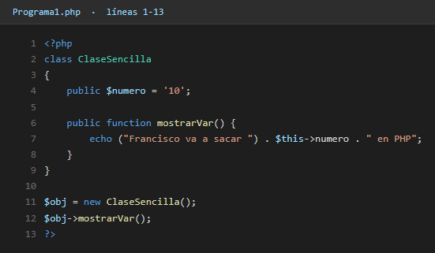

Salida:

---

## Programa 2 - Instancias y constructores

Aquí ya hay dos clases en el mismo archivo: `Animal` y `Coche`. La idea es practicar el constructor `__construct`, que es el método que se ejecuta automáticamente cuando creas un objeto con `new`. Sirve para inicializar las propiedades.

Clase `Animal` con `$especie` y `$edad`:

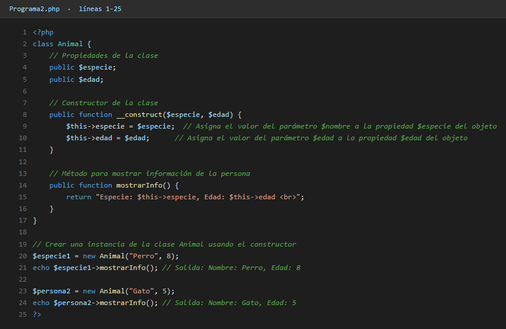

Clase `Coche` con `$marca` y `$modelo`:

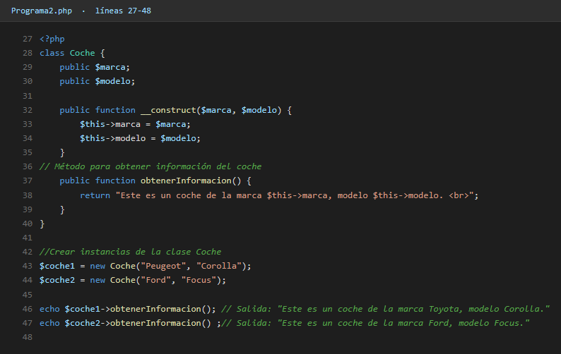

Salida:

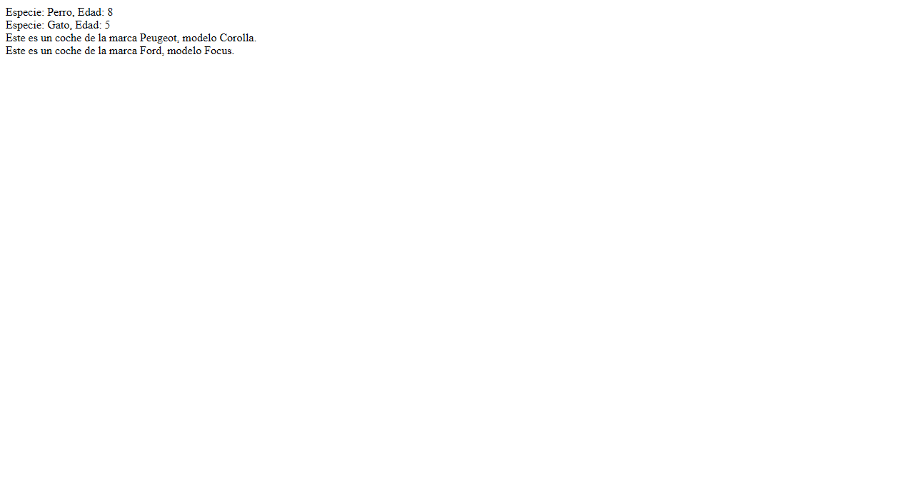

---

## Programa 3 - Constructor y destructor

Tres instancias de `Persona`. Importante: el método `__destruct` se ejecuta automáticamente cuando el objeto deja de existir (al final del script, normalmente). No hay que llamarlo a mano, PHP lo hace por nosotros.

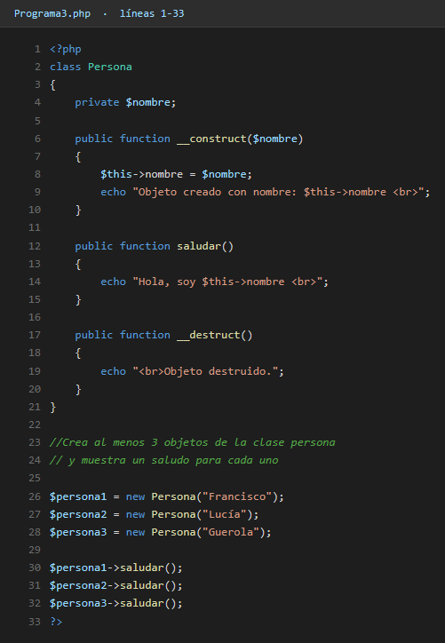

Salida:

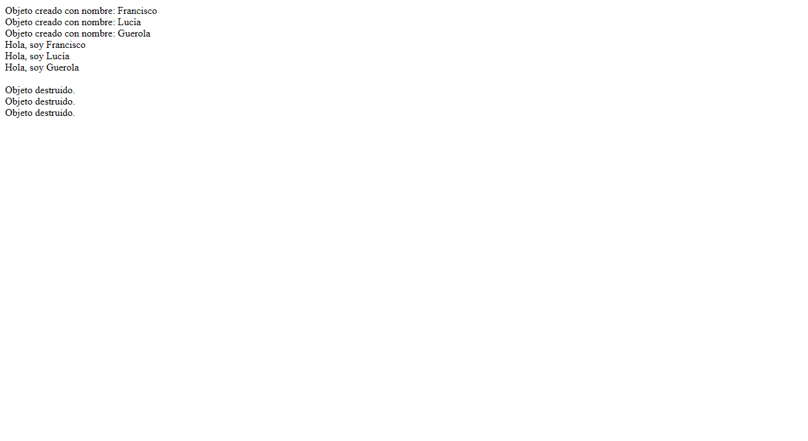

---

## Programa 4 - Getters y setters

Ejemplo clásico de encapsulamiento: las propiedades `$mayor` y `$menor` son `private`, así que no se pueden tocar desde fuera. Para leerlas y escribirlas existen los métodos `getMayor`, `getMenor`, `setMayor` y `setMenor`. El operador `?` en el tipo de retorno indica que la función puede devolver `null`.

Clase `MayorMenor`:

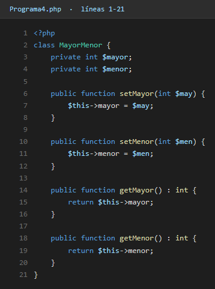

Función `maymen` que crea un objeto, le pasa los valores y lo devuelve:

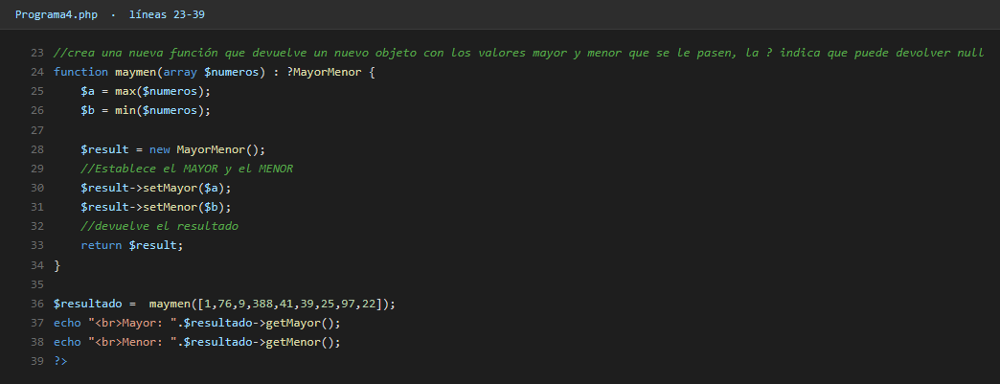

Salida:

---

## Programa 5 - `$this` y métodos estáticos

Aquí se ve la diferencia entre llamar a un método desde una instancia (con `$this` disponible) y desde un método estático (sin `$this`). La clase `C` tiene un método `static`, así que se invoca con `C::callTestThis()` sin necesidad de crear una instancia.

Clases A y B:

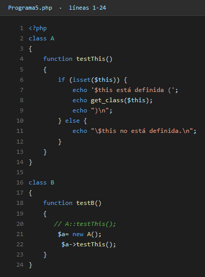

Clase C estática y llamadas finales:

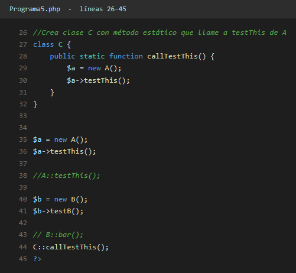

Salida:

---

## Programa 6 - Propiedad y método con el mismo nombre

Las propiedades y los métodos viven en espacios separados, así que pueden compartir nombre. La forma de distinguirlos es el contexto: `$obj->bar` accede a la propiedad, `$obj->bar()` llama al método. Aquí los dos se llaman `bar`.

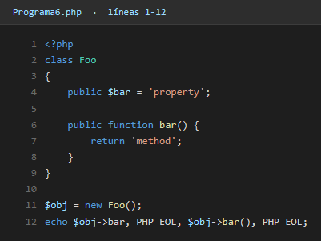

Salida (separadas por `PHP_EOL`, que es un salto de línea):

---

## Programa 7 - Encapsulamiento

`$saldo` es `private`, así que solo se puede modificar a través de `depositar()`. Si intentara acceder directamente desde fuera con `$cuenta->saldo`, daría error. Dentro de los métodos uso `$this->saldo`, donde `$this` se refiere al objeto actual.

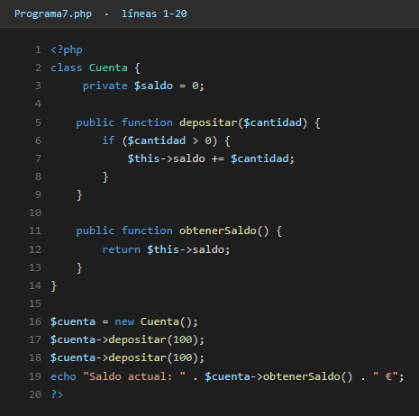

Salida:

---

## Programa 8 - Herencia

La herencia permite que una clase reciba propiedades y métodos de otra. Aquí `Perro` hereda de `Animal` y sobrescribe el método `hacerSonido()`. Dentro de la versión sobrescrita uso `parent::hacerSonido()` para llamar al método original de la clase padre.

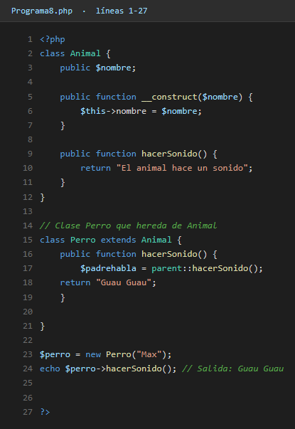

Salida:

---

## Programa 9 - Polimorfismo

El polimorfismo permite que distintas clases tengan métodos con el mismo nombre pero comportamientos diferentes. Aquí `Cuadrado` y `Circulo` heredan de `Figura` y cada una implementa su propio `calcularArea()`. Después se recorren con un `foreach` tratándolas como si fueran del mismo tipo.

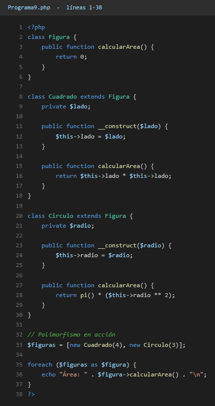

Salida:

---

## Programa 10 - Clases abstractas

Una clase **abstracta** no se puede instanciar directamente, sirve solo como plantilla. Obliga a las clases hijas a implementar los métodos marcados como `abstract`. Aquí `Transporte` es abstracta, y `Coche` y `Bicicleta` están obligadas a definir `mover()`.

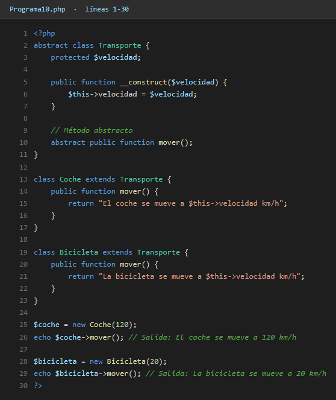

Salida:

---

## Programa 11 - Interfaces

Una **interfaz** es como un contrato: define qué métodos debe tener una clase, pero no cómo funcionan. Después, cualquier clase que implemente esa interfaz está obligada a definir todos los métodos. Aquí `Cuenta` implementa la interfaz `Operaciones`, así que tiene `depositar()` y `retirar()`.

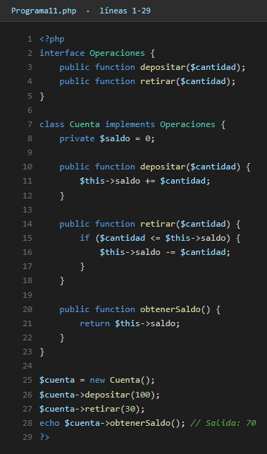

Salida:

---

## Programa 12 - `final`

La palabra clave `final` impide que una clase se herede o que un método se sobrescriba. Se usa para proteger lógica crítica que no se debe cambiar.

Clase `Calculadora` declarada como `final`:

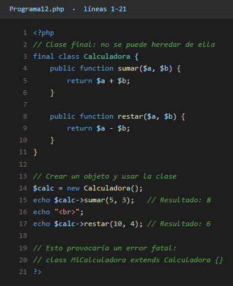

Método `final` dentro de una clase (`Base::conectar()`):

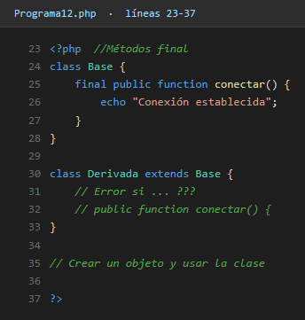

Clase `Email` como objeto-valor inmutable y final:

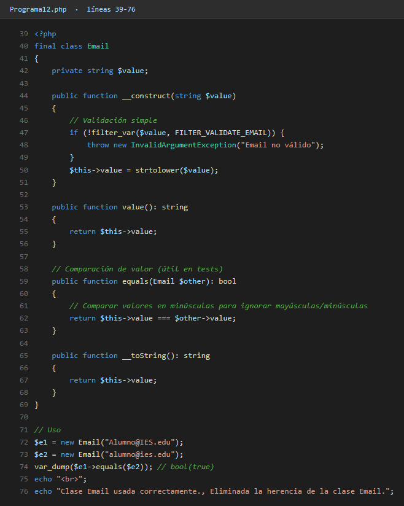

Salida:

---

## Programa 13 - Traits

Los **traits** son una forma de compartir métodos entre varias clases sin recurrir a la herencia. Básicamente son un "bloque de métodos" que se pueden inyectar en cualquier clase con `use`. Aquí el trait `Registro` aporta el método `registrarAccion()`, que reutilizan tanto `Usuario` como `Producto`.

Definición del trait:

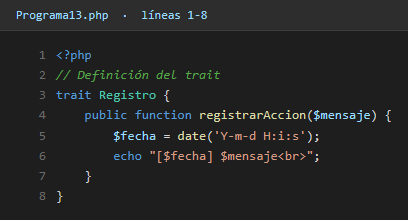

Clases que lo usan:

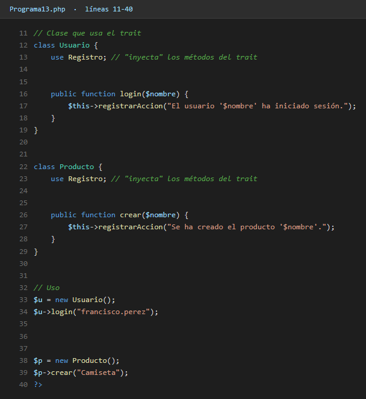

Salida:

---

## Programa 14 - Namespaces

Los **namespaces** sirven para organizar el código y evitar que dos clases con el mismo nombre choquen entre sí. Aquí defino las clases `Admin` y `Guest` dentro del namespace `Users`, y desde `Main.php` las importo con `use` y las uso normalmente.

Archivo `Main.php` (importa y usa las clases):

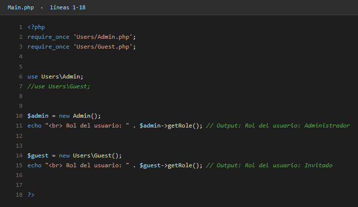

Archivo `Users/Admin.php`:

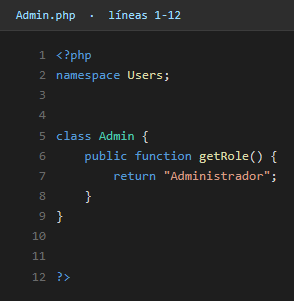

Archivo `Users/Guest.php`:

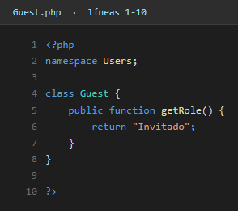

Salida:

---

## Programa 15 - SplStack (pilas)

`SplStack` es una clase de la Standard PHP Library (SPL) que implementa una **pila** (estructura LIFO: el último que entra es el primero que sale). Para meter elementos se usa `push()` y para sacarlos `pop()`. Útil para historiales de navegación, "deshacer" en editores, etc.

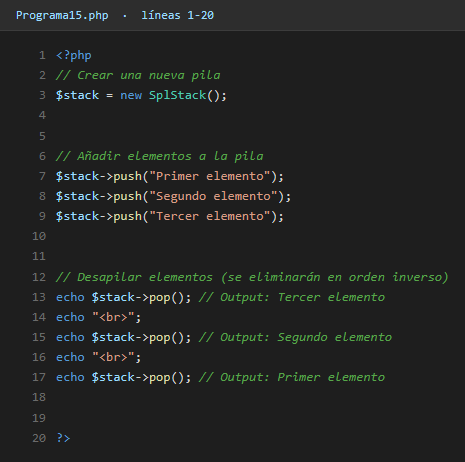

Salida:

---

## Programa 15b - SplQueue (colas) y SplFileObject

`SplQueue` es lo contrario de la pila: una **cola** FIFO (el primero que entra es el primero que sale). Se usa `enqueue()` para meter y `dequeue()` para sacar. También aprovecho para probar `SplFileObject`, que es una forma orientada a objetos de leer ficheros línea a línea.

SplQueue:

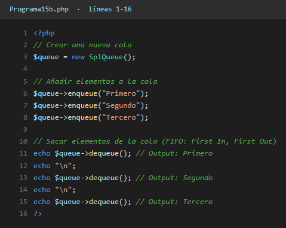

SplFileObject leyendo el propio `Entrega3.md`:

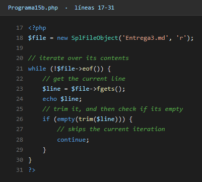

Salida:

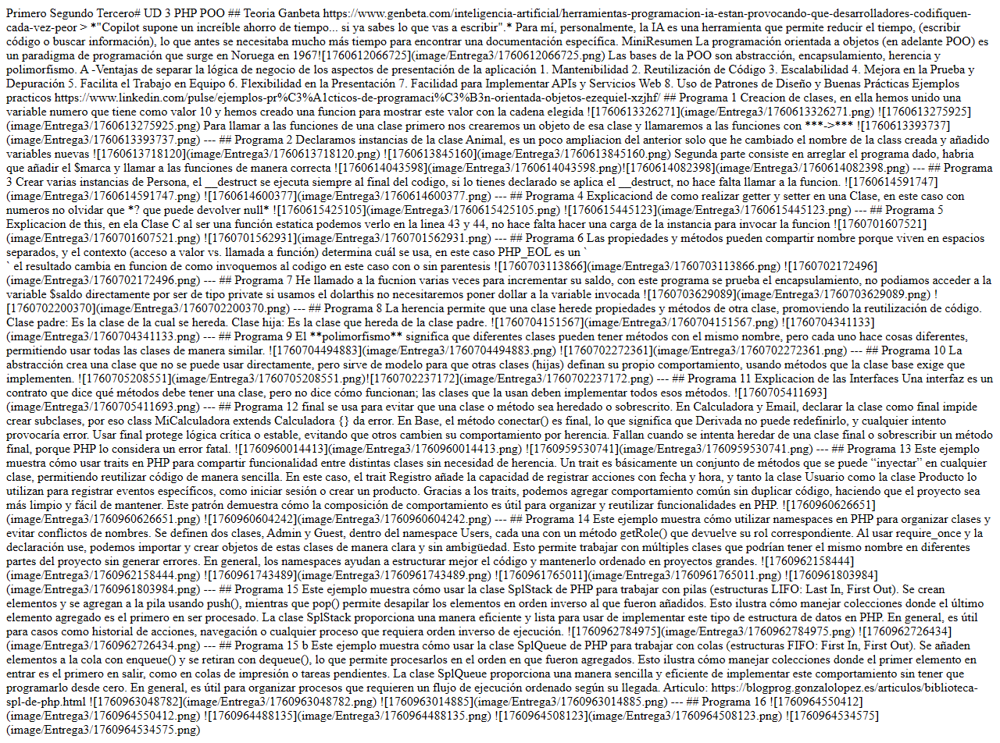

---

## Programa 16 - Autoload con `spl_autoload_register`

Cuando un proyecto tiene muchas clases, escribir un `require_once` por cada archivo se hace pesadísimo. La solución es **autoload**: una función que se registra con `spl_autoload_register` y que PHP llama automáticamente cuando intentas usar una clase que no está cargada.

`index.php` con el autoload:

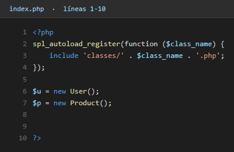

`classes/User.php`:

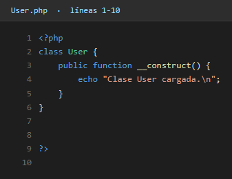

`classes/Product.php`:

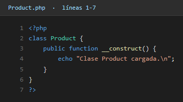

Salida:

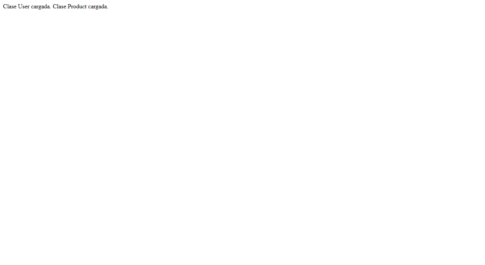

---

## Conclusiones

Lo que me llevo de esta unidad:

- POO **no es solo "meter clases por meterlas"**, sino que tiene unos pilares concretos (encapsulamiento, herencia, polimorfismo, abstracción) que ayudan a estructurar mejor el código.
- Saber cuándo usar herencia y cuándo `trait` o `interface` es clave: la herencia es para clases que son "del mismo tipo", los traits para compartir comportamiento entre clases distintas, y las interfaces para garantizar que algo cumple un contrato.
- Las clases `abstract` y `final` son herramientas para forzar o impedir cosas según convenga.
- Los **namespaces** y el **autoload** son básicos en cualquier proyecto medianamente grande.
- La **SPL** ya trae estructuras de datos hechas (pilas, colas, ficheros…), así que no hace falta reinventarlas.

Esta unidad es una de las más densas porque cambia la forma de pensar el código, pero también es donde más se nota la diferencia con respecto al PHP que veníamos haciendo.
