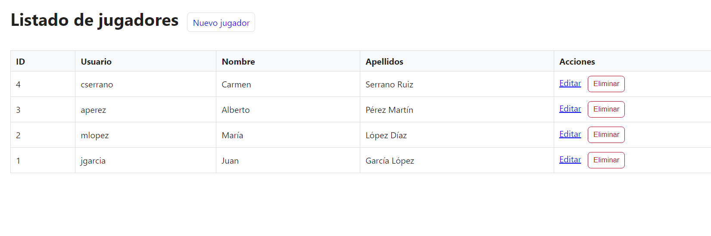
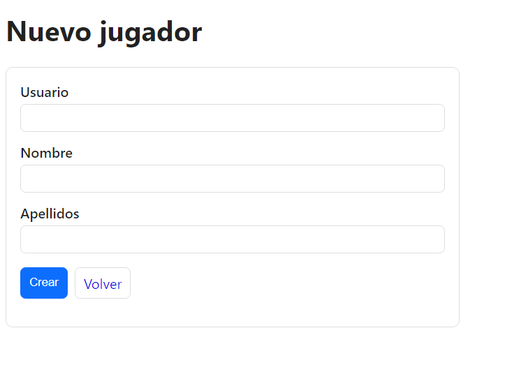
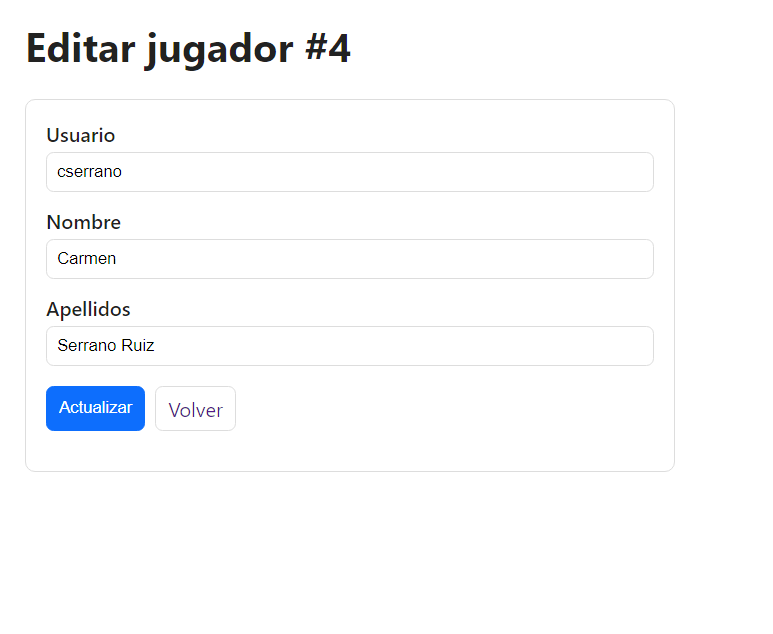
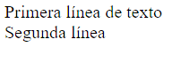
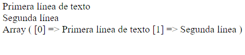
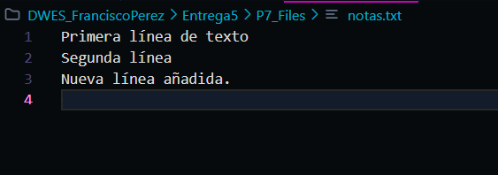
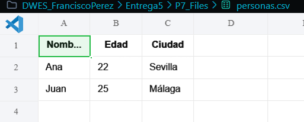
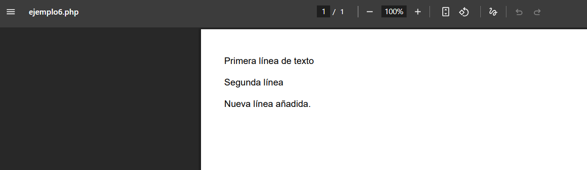
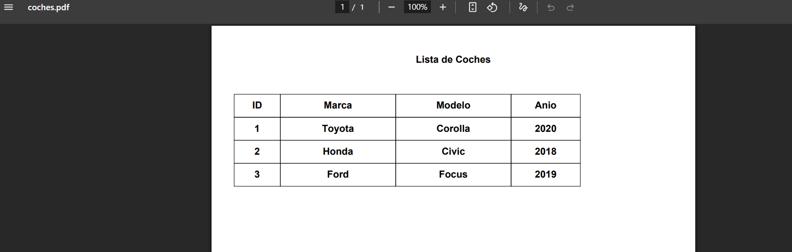
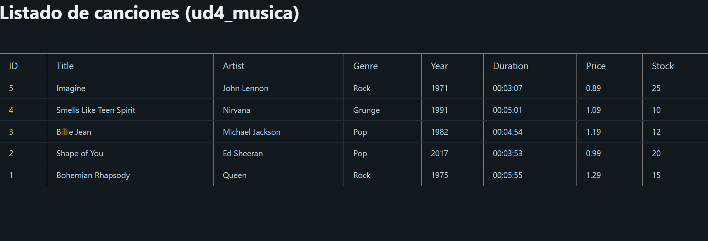

# Resumen de la Entrega 5

Esta entrega contiene varios proyectos y ejemplos de PHP que demuestran diferentes conceptos de desarrollo web del lado del servidor.

## P5_CRUD_MVC

Implementación de un sistema **CRUD** (Crear, Leer, Actualizar, Borrar) para la gestión de coches, siguiendo el patrón de arquitectura **Modelo-Vista-Controlador (MVC)**. Al incorporarme en clase recientemente no he entendido muy bien este apartado, me peleare con el en casa tranquilamente hasta entender el lenguaje completamente.

- **Modelo:** `app/models/Coche.php`
- **Vista:** `app/views/Coches/`
- **Controlador:** `app/controllers/CocheController.php`
- **Base de datos:** Utiliza MySQL/MariaDB, con el script de creación en `Database.sql`.

## P5_Login

Un proyecto que implementa un sistema de **inicio de sesión de usuario** utilizando el patrón MVC. Al incorporarme en clase recientemente no he entendido muy bien este apartado, me peleare con el en casa tranquilamente hasta entender el lenguaje completamente.

- **Modelo:** `app/models/Persona.php`
- **Vistas:** `app/views/Login.php` y `app/views/welcome.php`.
- **Controlador:** `app/controllers/PersonaController.php`
- **Configuración:** La conexión a la base de datos se define en `config/database.php`.

## P6_CRUD_SQLITE

Otro ejemplo de un sistema **CRUD**, esta vez para gestionar jugadores, pero utilizando **SQLite** como motor de base de datos.

- **Modelo:** `models/Jugador.php`
- **Vistas:** `views/jugadores/` (index, crear, editar, _form).
- **Controlador:** `controllers/JugadorController.php`
- **Base de datos:** La base de datos SQLite se almacenaría en el directorio `data/`.

## P7_Files

Este directorio contiene varios scripts de PHP que demuestran el **manejo de archivos**:

- Lectura y escritura de archivos de texto (`notas.txt`).
- Procesamiento de archivos CSV (`personas.csv`).
- Integración con la librería **FPDF** para la **generación de documentos PDF** a partir de datos.

## P8_MysqliPDF

Un proyecto que combina la conexión a una base de datos **MySQL** (utilizando la extensión `mysqli`) con la generación de informes en formato **PDF** utilizando la librería FPDF. El script `ud4_coches.sql` contiene la estructura de la base de datos necesaria.

## PDO

Ejemplos básicos sobre cómo utilizar **PHP Data Objects (PDO)** para conectar y realizar consultas a una base de datos.

- `conexion_pdo.php`: Muestra cómo establecer una conexión.
- `1-read.php`: Ejemplo de cómo leer datos de una tabla.
- `ud4_musica.sql`: Script SQL para crear la base de datos de ejemplo.

