# UD4 - Acceso a datos con PHP

**Alumno:** Francisco Pérez Ruiz
**Asignatura:** Desarrollo Web en Entorno Servidor (DWES)

---

## Introducción

En esta unidad damos el paso de "hacer cosas con PHP" a "hacer cosas con PHP **conectado a una base de datos**". Es uno de los apartados más prácticos, porque casi cualquier aplicación web real necesita guardar y leer datos en algún sitio.

Durante la unidad se ven dos formas de conectarse a MySQL desde PHP:

- **MySQLi**: la extensión "clásica", específica de MySQL. Tiene una API procedural y otra orientada a objetos.
- **PDO** (PHP Data Objects): una capa de abstracción que sirve para muchas bases de datos (MySQL, SQLite, PostgreSQL, etc.). Es la opción más moderna.

También se tocan temas alrededor: transacciones, prevención de **inyección SQL**, patrón **MVC**, **SQLite** como alternativa ligera y, al final, manejo de **ficheros** y generación de **PDFs** con FPDF.

---

## Un poco de historia de PHP

PHP nació en 1994 de la mano de Rasmus Lerdorf. Empezó como una herramienta personal para gestionar su página web, pero con el tiempo se convirtió en uno de los lenguajes más usados en el mundo del desarrollo web.

Algunos hitos importantes:

- **PHP 3 (1998):** se sentaron las bases del lenguaje moderno: analizador sintáctico nuevo, soporte para muchas bases de datos.
- **PHP 4 (2000):** apareció el motor Zend, que aumentó mucho la velocidad de ejecución.
- **PHP 5 (2004):** la POO en PHP se vuelve seria de verdad. Estuvo en el mercado más de 11 años.
- **PHP 7 (2015):** mejoras enormes de rendimiento (la versión 6 se saltó). De aquí se pasa a PHP 8.
- **PHP 8 (2020 en adelante):** JIT, tipos más estrictos, atributos.

---

## P1 - Primera conexión con MySQLi

El punto de partida: conectarse a una base de datos `dwes` en MySQL y leer una tabla `ud4_persona`.

Pasos clave:

1. Crear la base de datos `dwes` desde phpMyAdmin.
2. Crear la tabla `ud4_persona` con los campos `id`, `nombre`, `apellidos`, `telefono`.
3. Desde PHP, usar `mysqli_connect("localhost", "root", "", "dwes")` para conectarse.
4. Lanzar una `SELECT` con `mysqli_query()` y recorrer el resultado con `foreach`.

**Código de la conexión + consulta:**

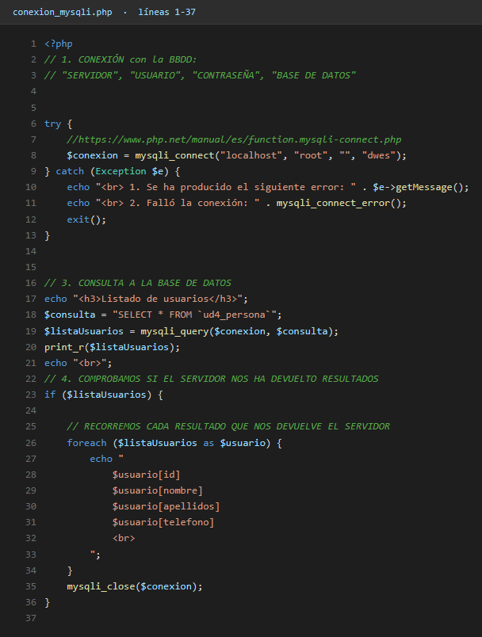

---

## P2 - CRUD completo con MySQLi y transacciones

Este apartado da un salto en complejidad. Ya no es solo "leer datos", sino hacer **CRUD completo** (Create, Read, Update, Delete) con buenas prácticas: **prepared statements** (para evitar inyección SQL) y **transacciones** (para garantizar que las operaciones críticas se hagan en bloque o se reviertan).

### Conexión centralizada

En vez de copiar la conexión en cada archivo, se centraliza en una función `db()` que devuelve siempre la misma conexión.

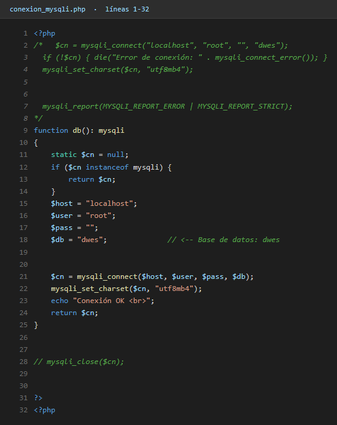

### Insertar con transacción

`mysqli_begin_transaction` + `mysqli_commit` (o `mysqli_rollback` si algo falla). Si una de las dos inserciones falla, **ninguna** se guarda.

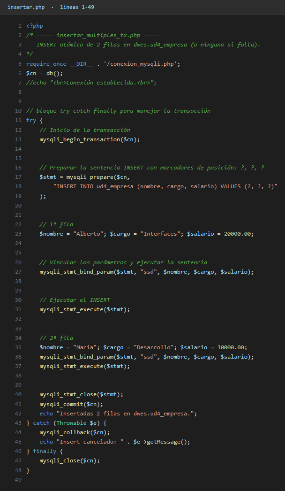

### Select con bloqueo `FOR UPDATE`

Lectura de una fila con bloqueo, para garantizar que nadie más la modifique entre que la leo y la actualizo.

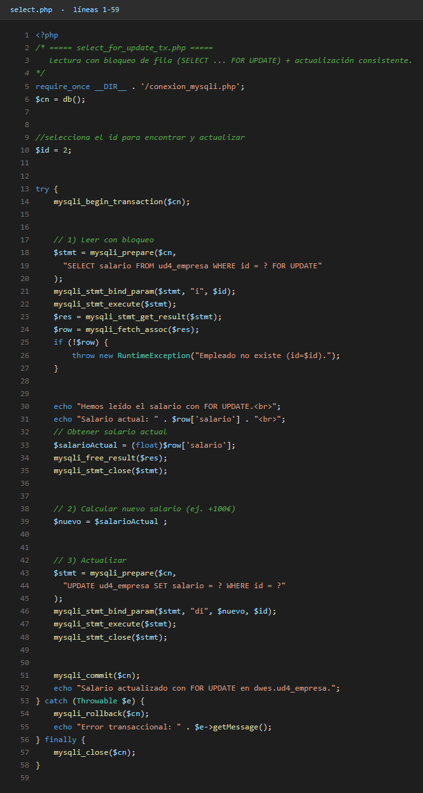

### Actualizar con validación

Update protegido: si no se afecta exactamente 1 fila, se lanza una excepción y se hace `rollback`.

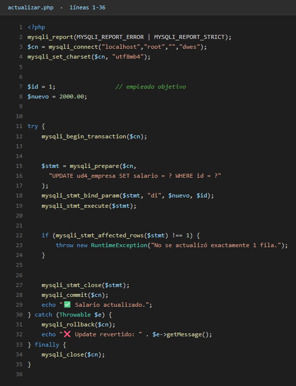

### Borrar con validación

Misma idea para el `DELETE`. Si no se borra 1 fila, se cancela.

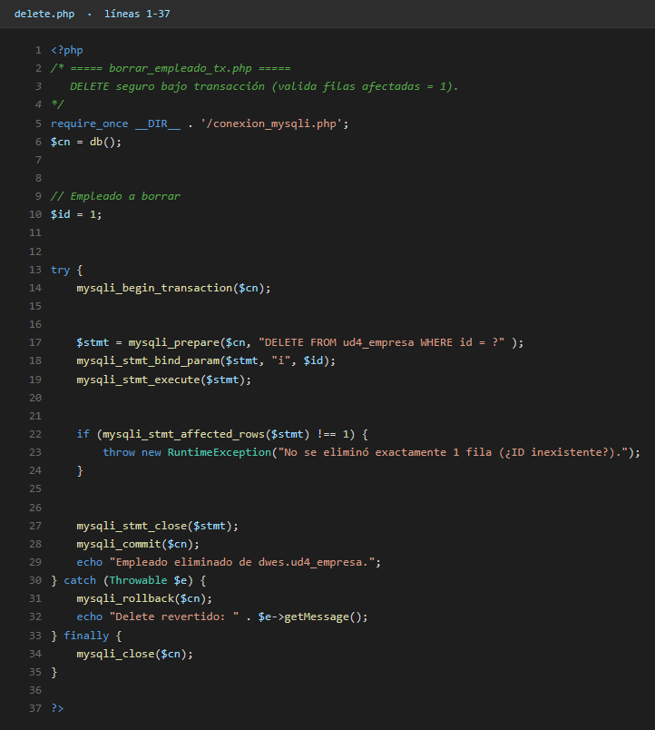

### Inyección SQL (mal ejemplo)

Aquí se ve por qué **nunca** se debe concatenar la entrada del usuario directamente en una consulta. Con `' OR '1'='1` se consigue que se muestren todos los empleados.

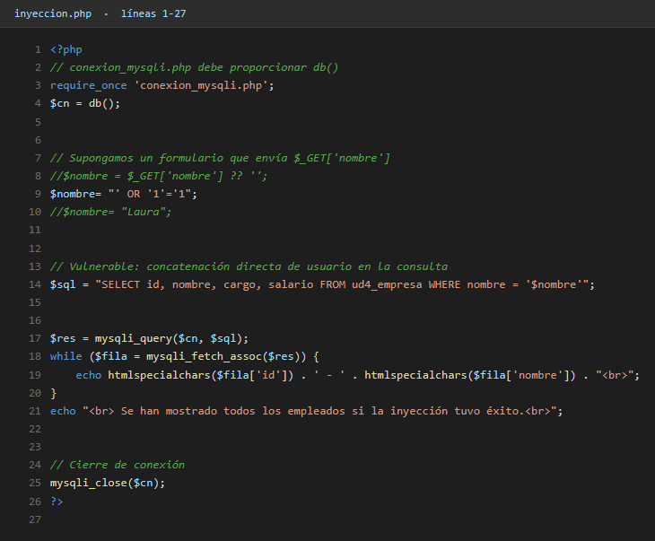

La forma correcta es usar marcadores (`?` o `:nombre`) y `bind_param` / `bindValue`, como en los ejemplos anteriores.

---

## P3 - Conexión con PDO

PDO es la alternativa "moderna" a MySQLi. La gran ventaja: el mismo código sirve para MySQL, SQLite, PostgreSQL, etc., cambiando solo el DSN.

### Conexión centralizada con PDO

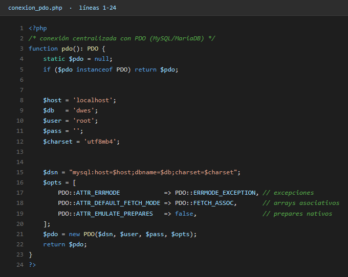

Detalle importante: configuro `ERRMODE_EXCEPTION` para que cualquier error de SQL lance una excepción (mucho más fácil de manejar que comprobar códigos a mano), y `EMULATE_PREPARES => false` para usar prepares nativos del motor.

### Listado de canciones con CSS

Ejemplo práctico: conexión PDO + lectura completa de la tabla `ud4_musica` + presentación en HTML con la librería Pico.css.

Primera parte (conexión + consulta):

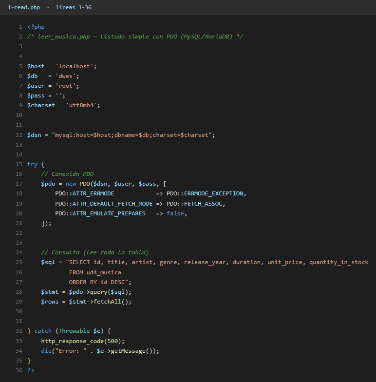

Segunda parte (HTML con la tabla):

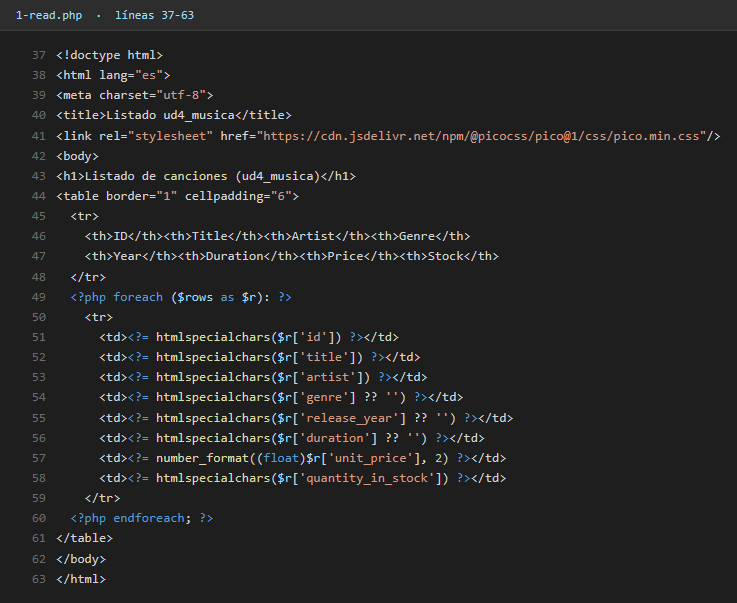

---

## P5_Login - Login con patrón MVC

Aquí se introduce el **patrón Modelo-Vista-Controlador (MVC)** aplicado a un sistema de login. La idea es separar bien las responsabilidades:

- **Modelo** (`Persona.php`): lógica de negocio, acceso a datos.
- **Vista** (`Login.php`, `welcome.php`): solo HTML.
- **Controlador** (`PersonaController.php`): recibe la petición, llama al modelo y elige la vista.
- **Configuración** (`config/database.php`): conexión PDO encapsulada en una clase `Database`.

### Conexión `database.php`

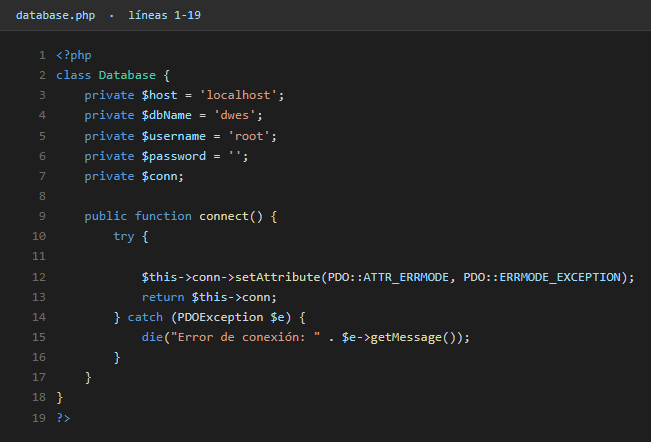

### Modelo `Persona.php`

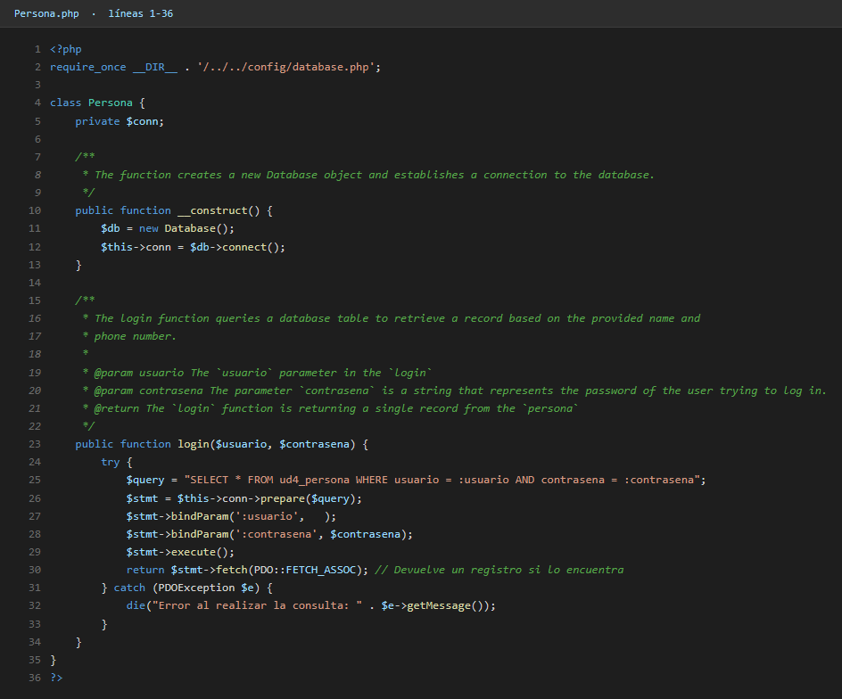

### Controlador `PersonaController.php`

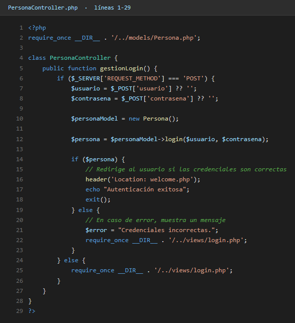

### Punto de entrada `index.php`

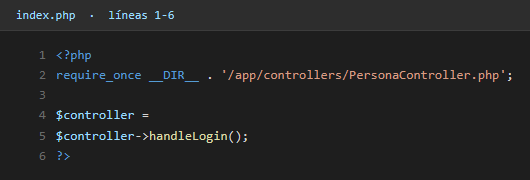

---

## P5_CRUD_MVC - CRUD completo de coches con MVC

Misma arquitectura MVC pero ahora con todas las operaciones CRUD aplicadas a una tabla `coches`. El controlador tiene los métodos típicos:

- `index()` → muestra todos los coches.
- `crear()` → inserta uno nuevo.
- `editar()` → modifica uno existente.
- `eliminar()` → borra uno.

### Modelo `Coche.php`

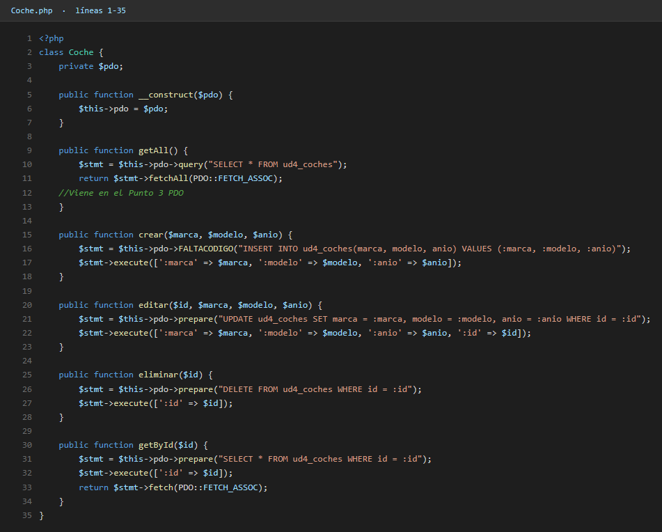

### Controlador `CocheController.php`

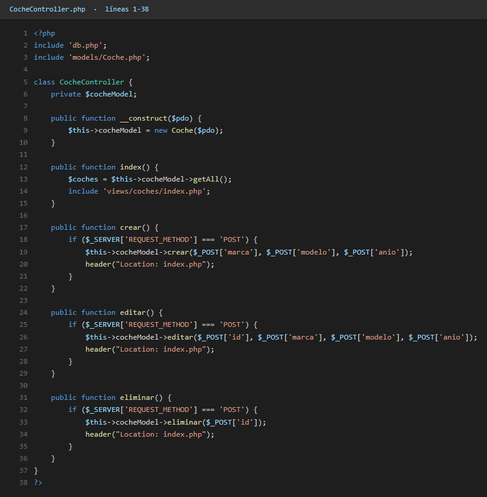

### Punto de entrada `index.php`

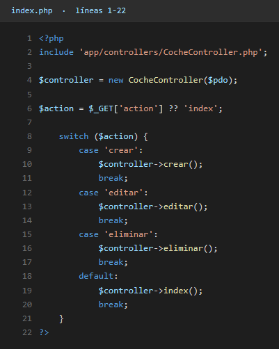

---

## P6 - CRUD con SQLite

En este apartado se cambia el motor: en vez de MySQL/MariaDB se usa **SQLite**. SQLite no necesita un servidor: la base de datos es **un archivo dentro del propio proyecto**.

Esto es muy práctico para proyectos pequeños o pruebas, porque no hay que tener nada arrancado (ni el puerto 3306 de MySQL).

### `config.php` (crea la BD y la tabla si no existen, e inserta jugadores de prueba)

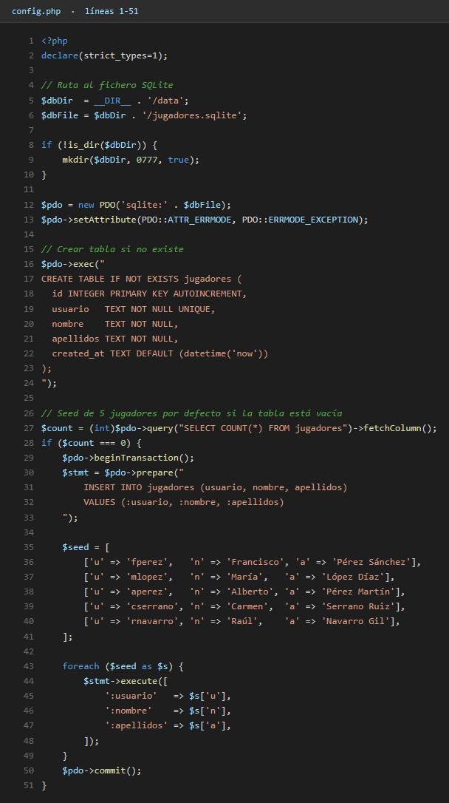

### Modelo `Jugador.php`

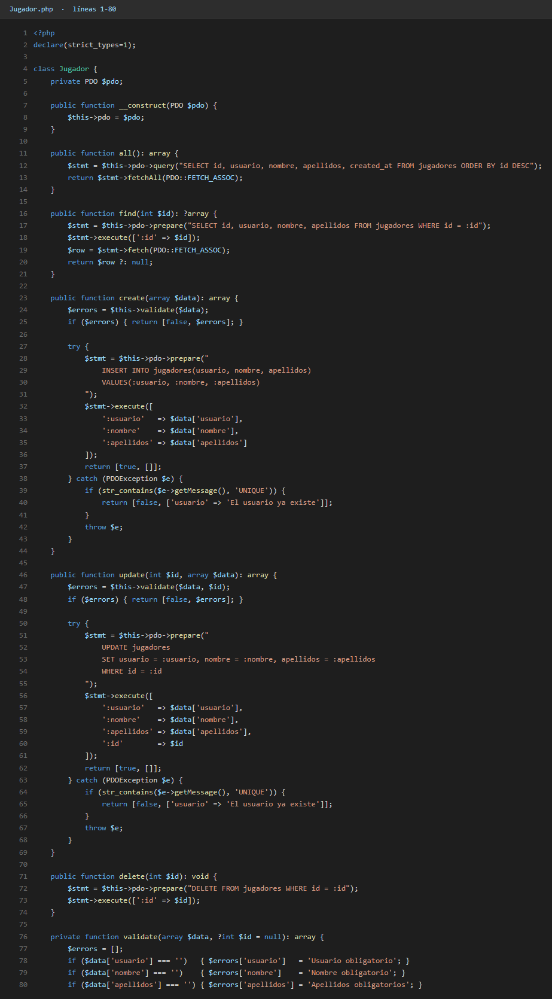

### Controlador `JugadorController.php`

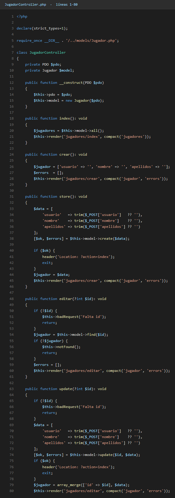

Capturas del proyecto en funcionamiento:

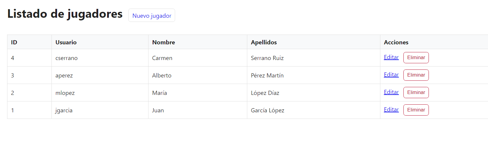

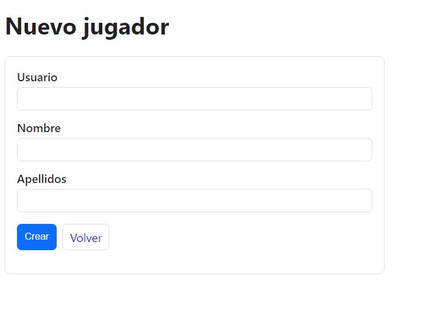

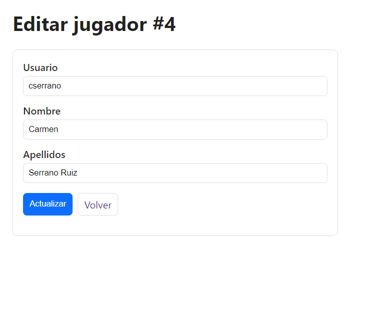

---

## P7 - Manejo de ficheros

Aquí se trabaja con archivos directamente desde PHP: lectura, escritura, CSV y PDF.

### Ejemplo 1 - Crear/escribir y leer un archivo de texto

Crea (o sobrescribe) `notas.txt`, escribe dos líneas y luego lee el archivo línea a línea.

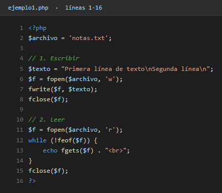

### Ejemplo 2 - Leer un archivo completo

Lee el contenido entero con `file_get_contents` y también lo divide en un array con `file()`.

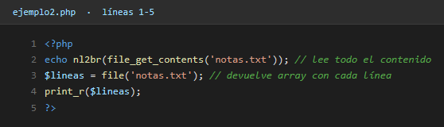

### Ejemplo 3 - Añadir al final (modo `'a'`)

Modo "append": añade contenido al final del archivo sin borrar lo anterior.

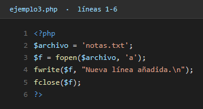

### Ejemplo 4 - Generar y descargar un CSV

Crea un archivo CSV con `fputcsv` y manda cabeceras para que el navegador lo descargue.

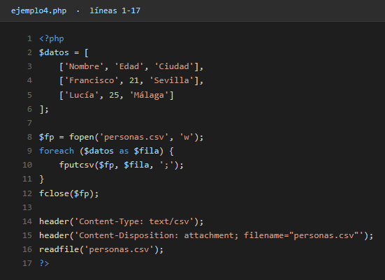

### Ejemplo 5 - PDF con FPDF

Primer PDF con la librería **FPDF**: añadir página, fuente y un par de líneas de texto.

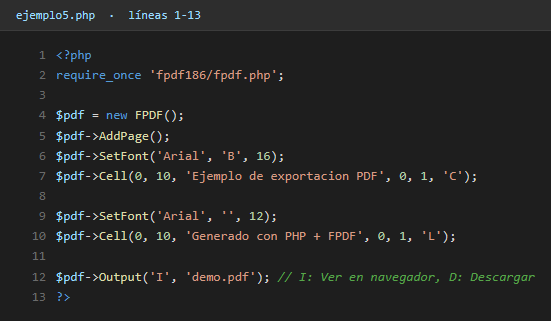

### Ejemplo 6 - Convertir `notas.txt` a PDF

Lee el archivo de texto línea a línea y vuelca cada línea en un PDF.

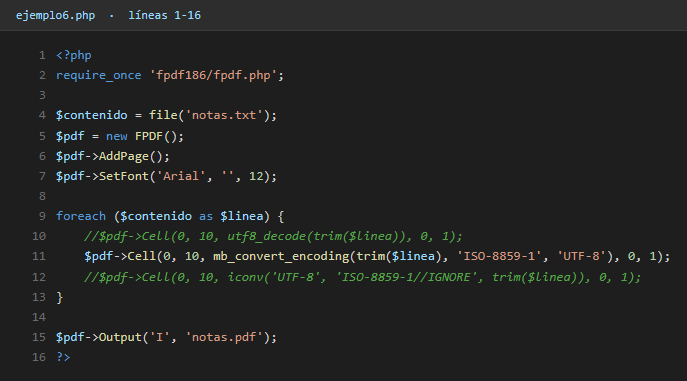

Capturas del manejo de ficheros en navegador:

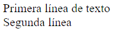

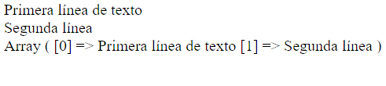

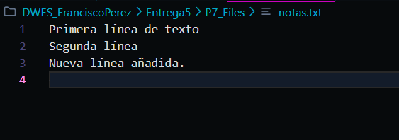

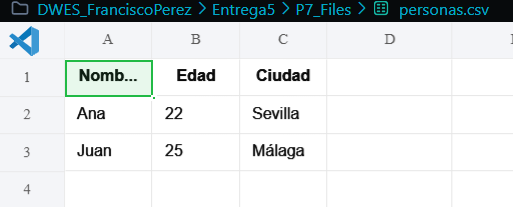

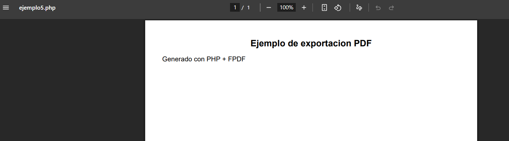

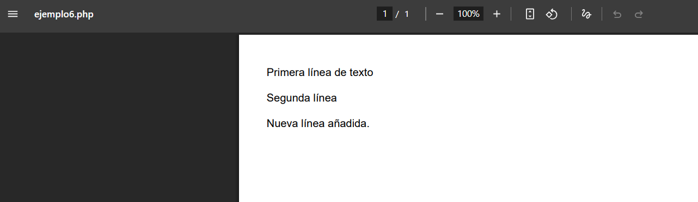

---

## P8 - MySQLi + PDF

El apartado final junta dos cosas que ya se han visto por separado: **MySQLi** para leer datos + **FPDF** para generar el documento.

El script se conecta a `dwes`, lee la tabla `ud4_coches` (id, marca, modelo, año) y genera un PDF con esos datos en formato de tabla.

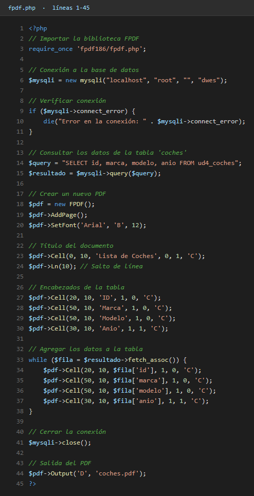

Captura del PDF generado:

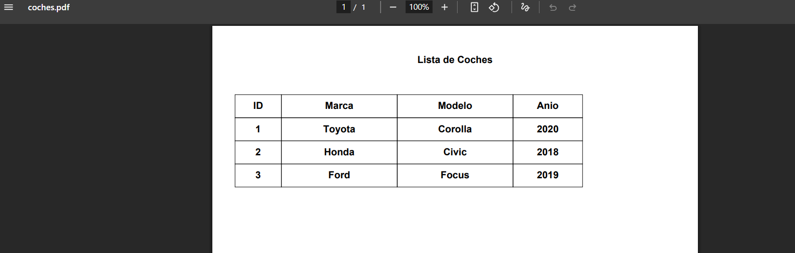

---

## Conclusiones

- **MySQLi** y **PDO** son dos formas válidas de hablar con MySQL. PDO es más portable y suele ser la opción recomendada hoy en día.
- Las **transacciones** son fundamentales cuando varias operaciones tienen que ir "todo o nada". Si una falla, se hace `rollback` y la base de datos queda como estaba.
- La **inyección SQL** se evita SIEMPRE con prepared statements. Concatenar entrada del usuario en SQL es uno de los errores más graves que se pueden cometer.
- El **patrón MVC** ordena el código en proyectos medianos/grandes. Separa lógica, presentación y datos.
- **SQLite** es perfecto para proyectos pequeños: BD en un archivo, sin servidor.
- **FPDF** es la forma más clásica de generar PDFs en PHP. Para informes a partir de la BD, es lo más rápido.

Esta es la unidad donde por fin se siente que PHP es "un lenguaje serio para hacer aplicaciones reales", porque ya hay base de datos, capas separadas y exportación a formatos profesionales.
