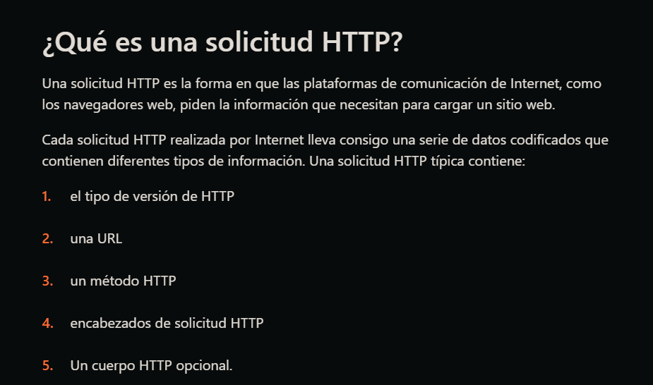
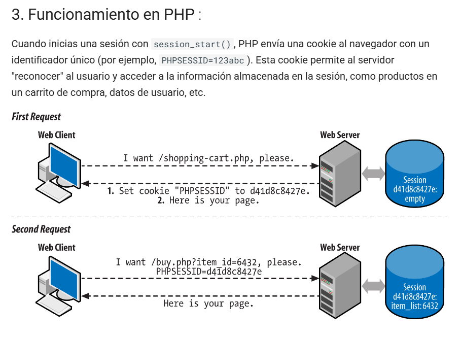
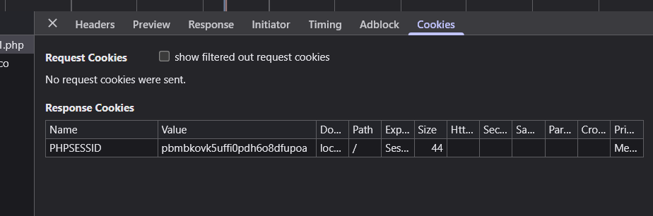
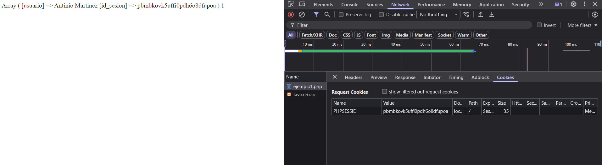

# UD5: Desarrollo de servicios web

## 0. Protocolo HTTP

El **Protocolo de Transferencia de Hipertexto (HTTP)** es el conjunto de reglas que permite la comunicación y transferencia de información en la World Wide Web. Es la base sobre la que se comunican los navegadores web (clientes) y los servidores web.

Funciona bajo un esquema de petición-respuesta entre un cliente y un servidor:

1. **Petición HTTP**: El cliente (ej. un navegador) envía una petición a un servidor para acceder a un recurso (una página web, una imagen, etc.).
2. **Respuesta HTTP**: El servidor procesa la petición y devuelve una respuesta al cliente, que incluye el estado de la solicitud (ej. `200 OK` o `404 Not Found`) y el contenido solicitado.

HTTP es un protocolo "sin estado", lo que significa que cada petición es independiente y el servidor no almacena datos de sesiones anteriores del mismo cliente.

