# Clothing Store V3 - CRUD de Usuarios

## Estructura del Proyecto

Este proyecto sigue un patrón común para CRUDs sencillos en Laravel.

### Patrón utilizado

- **Vistas organizadas por recurso**: `resources/views/users/`
- **Parcial de formulario reutilizable**: `_form.blade.php`
- **Páginas por recurso**: `index`, `create`, `edit`, `show`
- **Redirecciones consistentes**: `store`, `update`, `destroy` → `index`
- **Sin validación** (simplificado para el curso)

---

## Archivos del CRUD de Usuarios

### 1. Modelo - `app/Models/User.php`

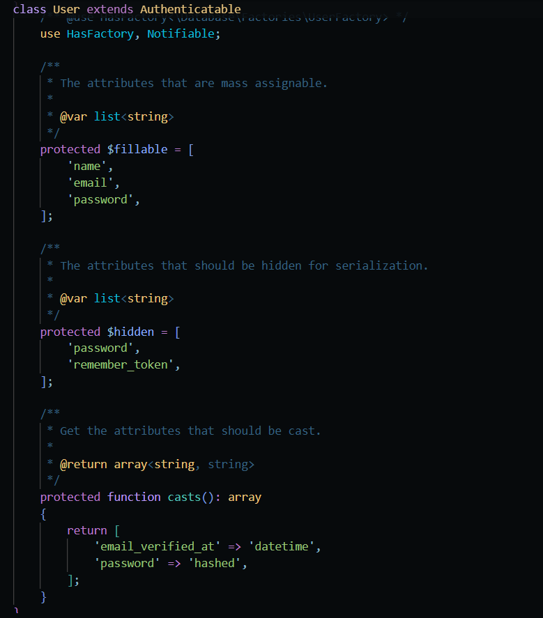

> **Nota**: Es importante definir `$fillable` para evitar errores de MassAssignment al usar `User::create()`.

---

### 2. Controlador - `app/Http/Controllers/UserController.php`

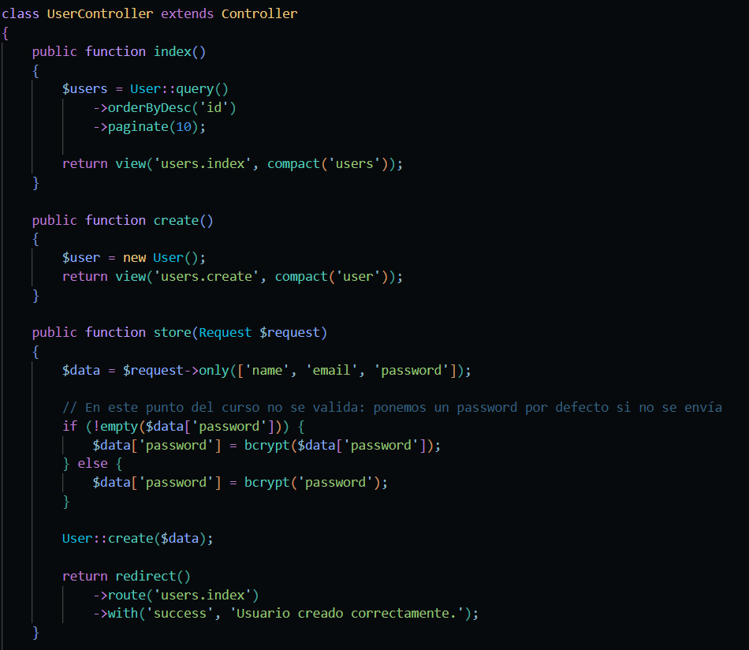

---

### 3. Rutas - `routes/web.php`

---

### 4. Factory - `database/factories/UserFactory.php`

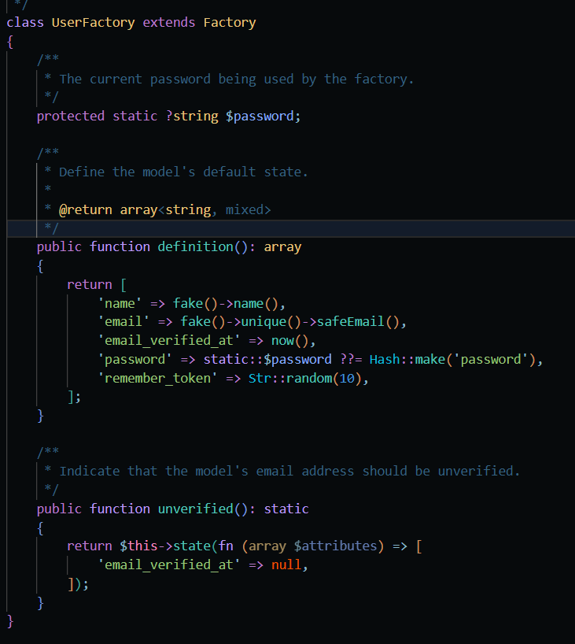

---

### 5. Seeder - `database/seeders/UserSeeder.php`

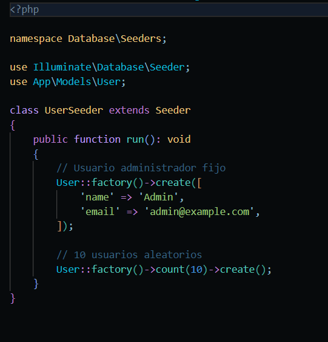

### 6. DatabaseSeeder - `database/seeders/DatabaseSeeder.php`

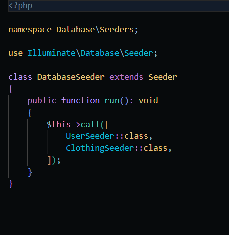

---

## Vistas

### 7. Layout - `resources/views/layouts/app.blade.php`

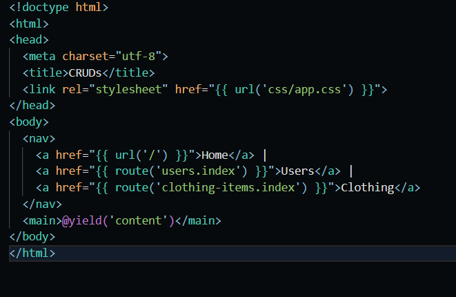

---

### 8. Vistas de Usuarios

#### `resources/views/users/index.blade.php`

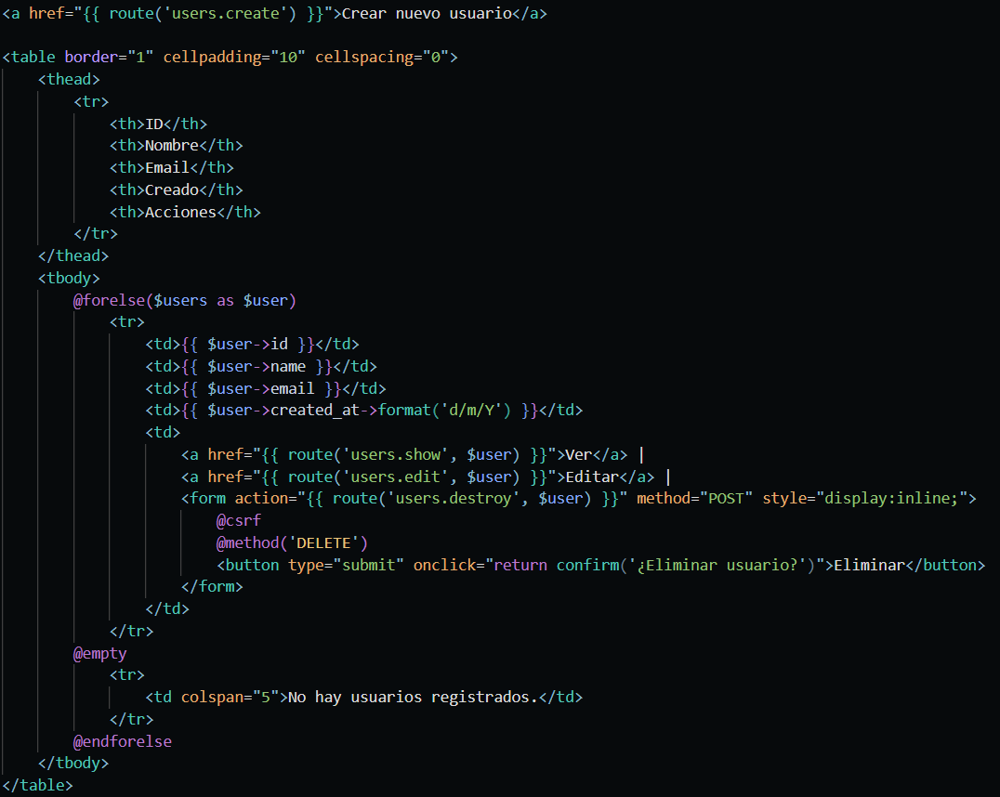

#### `resources/views/users/_form.blade.php`

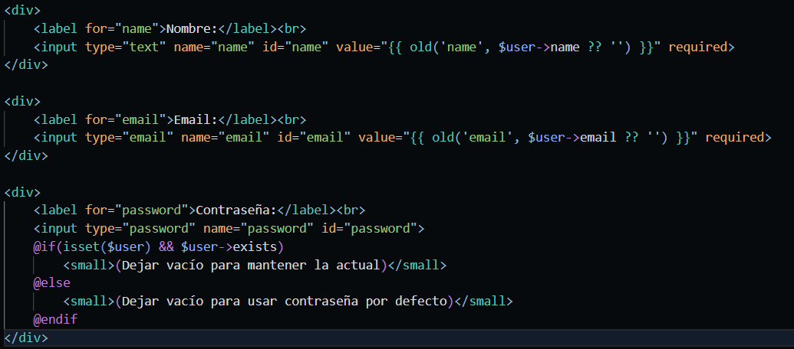

#### `resources/views/users/create.blade.php`

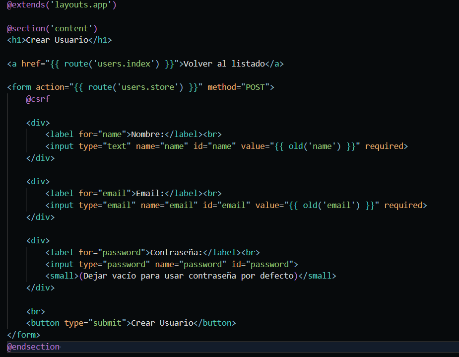

#### `resources/views/users/edit.blade.php`

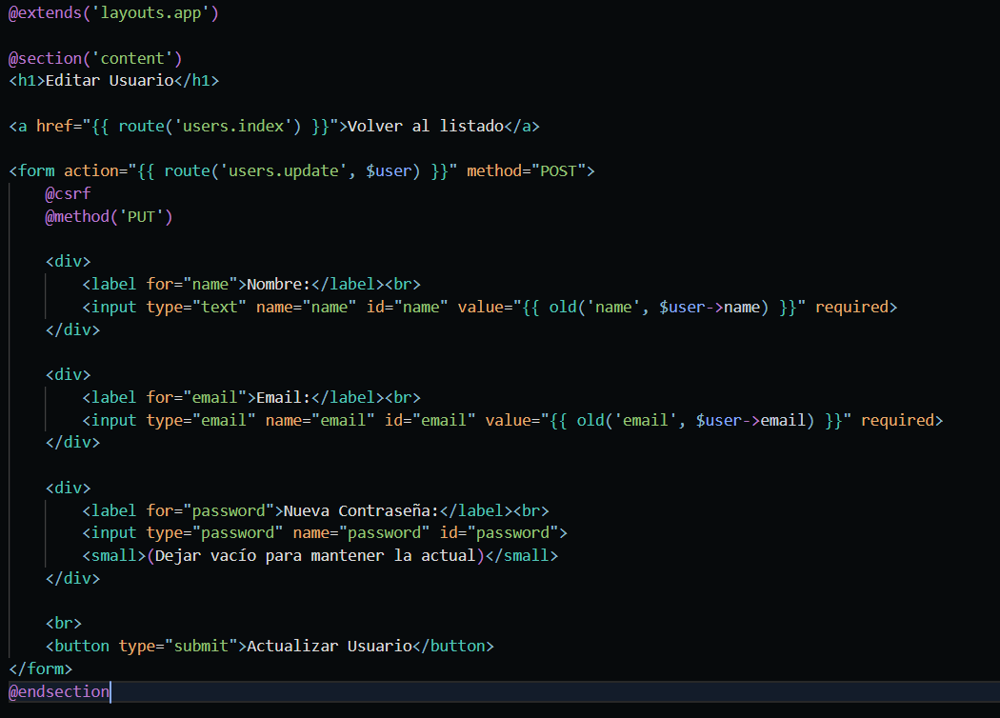

#### `resources/views/users/show.blade.php`

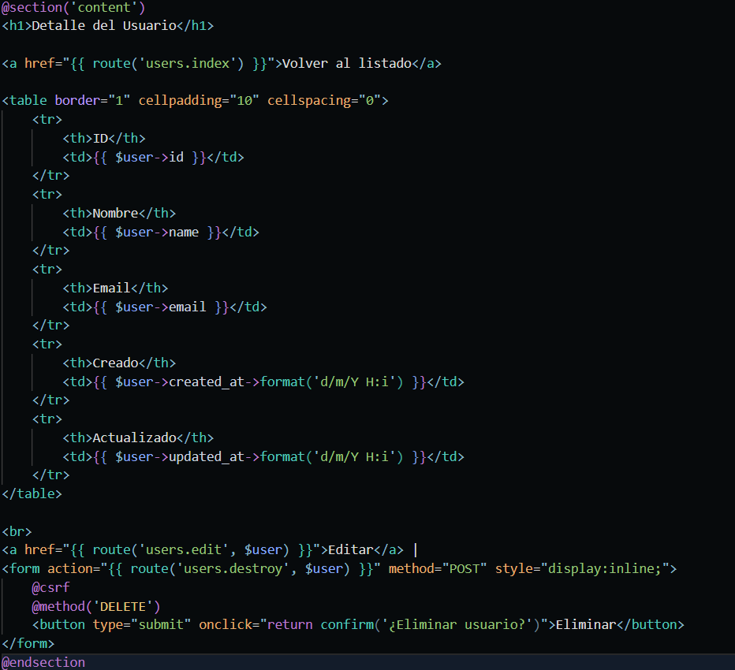

### Base de datos

Comandos

`php artisan migrate` Ejecuta las migraciones (crea las tablas)

`php artisan migrate:fresh` Borra todas las tablas y las vuelve a crear

`php artisan migrate:fresh --seed` Borra tablas, las recrea y ejecuta los seeders

`php artisan db:seed` Ejecuta todos los seeders

`php artisan db:seed --class=UserSeeder` Ejecuta solo el seeder de usuarios

---

### Limpiar caché

Comandos

`php artisan cache:clear` Limpia la caché de la aplicación

`php artisan view:clear` Limpia la caché de las vistas compiladas

`php artisan config:clear` Limpia la caché de configuración

---

### Servidor

Comando

|`php artisan serve`| Inicia el servidor de desarrollo en `http://127.0.0.1:8000`|
