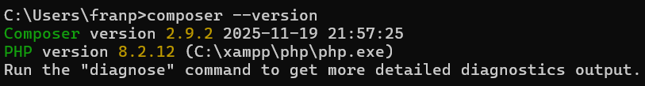
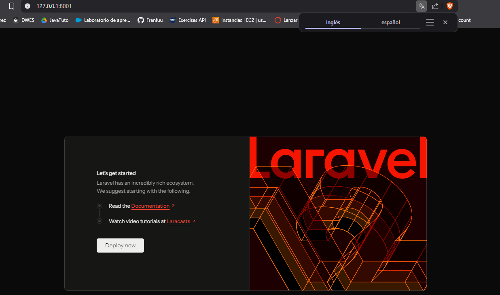
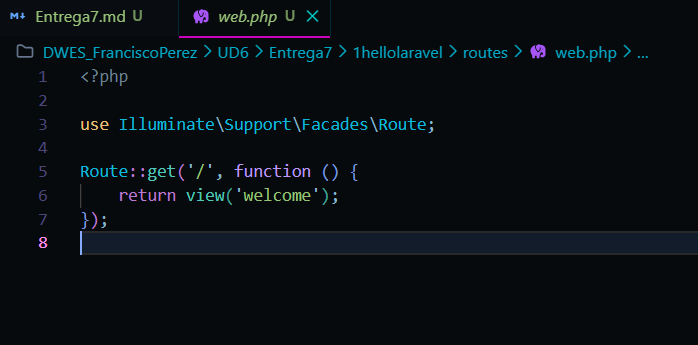
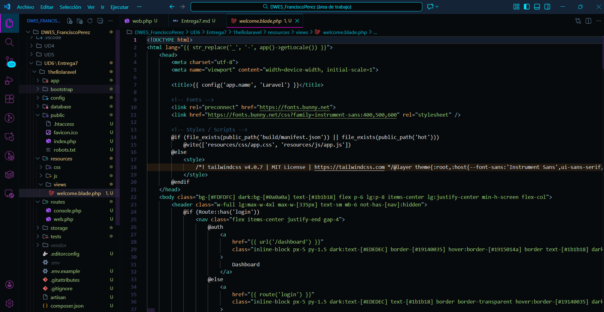
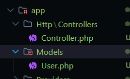

# Entrega 7

Documentacion Laravel

Instalacion Composer:

"composer create-project laravel/laravel 1hellolaravel"

Arrancar servicio:

Estar en la carpeta del proyecto y "php artisan serve"

Instalador:

"composer global require laravel/installer"

Carpetas mas importantes:

Routes

Vistas acaban con el motor de plantillas .blade.php

Los modelos y controllers se llevan desde la carpeta app

