# API Resources con Laravel - Apicity

**Alumno:** Francisco Pérez Ruiz

---

## Introducción

Este proyecto es el segundo de la unidad. Ahora que ya sé montar una API REST básica, toca dar el siguiente paso: los **API Resources**.

Un **Resource** en Laravel es una clase que transforma un modelo en un array antes de devolverlo como JSON. Sirve para:

- Elegir exactamente qué campos se exponen al exterior (ocultar `password`, `created_at`, etc.).
- Renombrar campos o calcular valores derivados antes de mandarlos.
- Centralizar la forma de la respuesta para que todos los endpoints sean consistentes.

Además, en este proyecto se prepara el modelo `User` para tokens con `HasApiTokens`, que es lo que abre la puerta a la autenticación con Sanctum en los apartados siguientes.

---

## Pasos que seguí

### 1. Instalar la API

Como siempre, lo primero es generar las rutas y configuración de la API:

```bash
php artisan install:api
```

Después de migrar la base de datos aparecen las tablas para los tokens (`personal_access_tokens`) y para el reseteo de contraseñas.

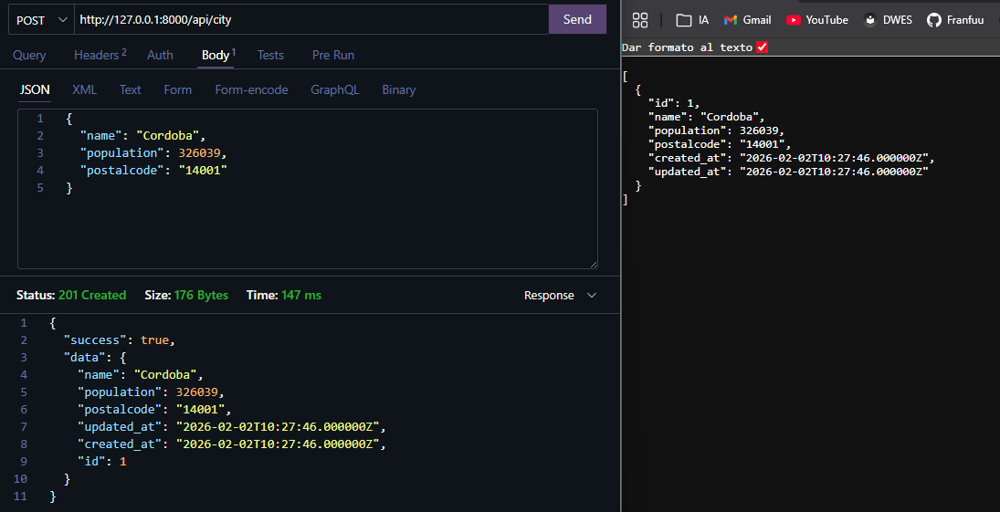

### 2. Crear el modelo City

Creé el modelo `City` junto con su migración con un único comando:

```bash
php artisan make:model City -m
```

En la migración añadí los campos típicos (`name`, `population`, `postal_code`...) y luego corrí `php artisan migrate` para subir la tabla.

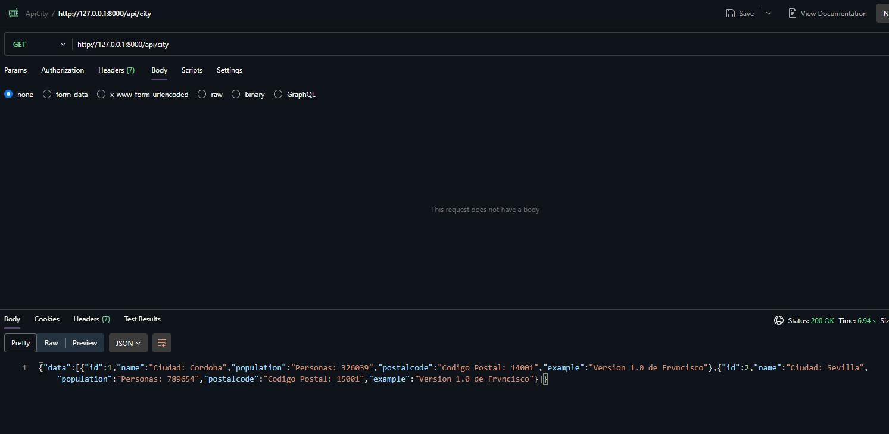

### 3. Controlador y rutas

El controlador se crea con la opción `--resource` para que ya traiga todos los métodos (`index`, `store`, `show`, `update`, `destroy`):

```bash
php artisan make:controller CityController --resource
```

Y la ruta queda así de simple en `routes/api.php`:

```php
Route::apiResource('/city', CityController::class);
```

Después modifiqué `update` para que actualice nombre, población y código postal, y `destroy` para que busque por ID y borre.

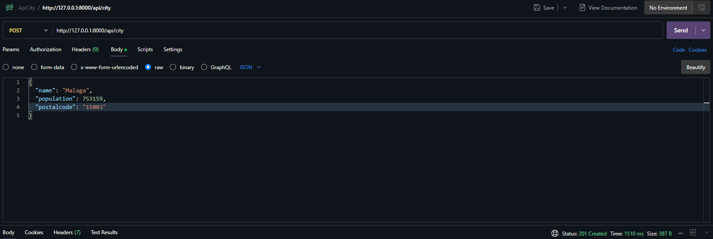

### 4. Crear el Resource

Aquí está la novedad de este apartado. Para crear el Resource:

```bash
php artisan make:resource CityResource
```

Eso genera una clase con un método `toArray()` donde decides qué exponer:

```php
public function toArray(Request $request): array
{
    return [
        'id'          => $this->id,
        'nombre'      => $this->name,
        'poblacion'   => $this->population,
        'codigo'      => $this->postal_code,
    ];
}
```

En el controlador, en vez de devolver el modelo directo, devuelvo `new CityResource($city)` (o `CityResource::collection($cities)` para listas).

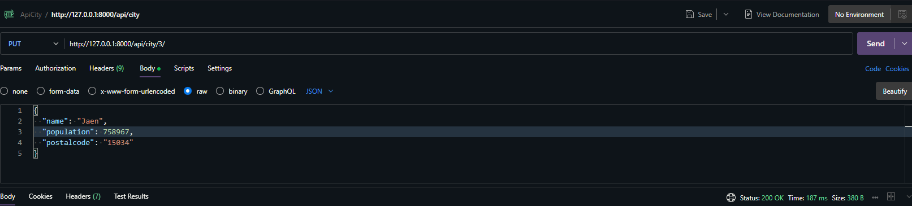

### 5. Probar la API con Thunder Client

Una vez todo está listo, levanté el servidor con `php artisan serve` y probé los endpoints con Thunder Client (la extensión de VS Code).

`GET /api/city` me devuelve la lista de ciudades con el formato definido en `CityResource`.

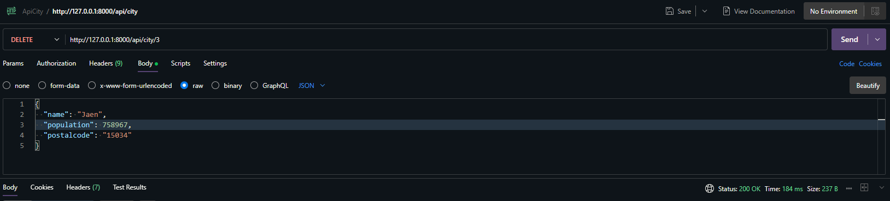

`POST /api/city` con un JSON con `name`, `population` y `postal_code` añade una ciudad.

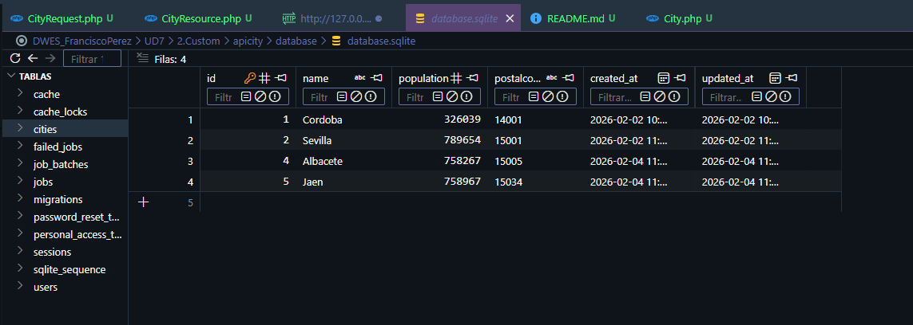

---

## Lo que aprendí en este proyecto

- Los **Resources** son la forma "correcta" de devolver datos en una API Laravel. Permiten desacoplar el modelo de la base de datos del JSON que sale al cliente.
- `HasApiTokens` en el modelo `User` es el primer paso para preparar autenticación con Sanctum. No se nota en este proyecto, pero los siguientes lo aprovechan.
- Usar `apiResource` en lugar de `resource` en las rutas evita rutas como `create` o `edit` que solo tendrían sentido si se usaran vistas HTML.
- Con `php artisan route:list` se ve fácilmente qué endpoints hay y a qué controlador van.

Este proyecto se siente como un puente entre lo básico de la API REST y los siguientes apartados, donde ya entra la autenticación.

---

## Código

### Modelo `City.php`

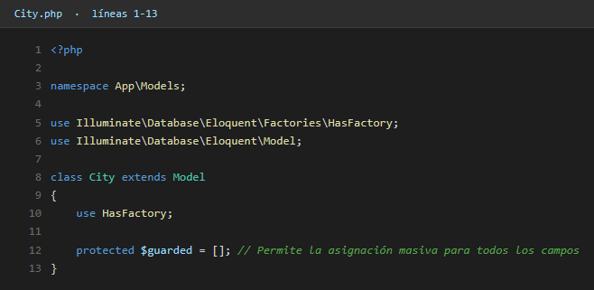

### `CityResource.php` (transforma el modelo a JSON)

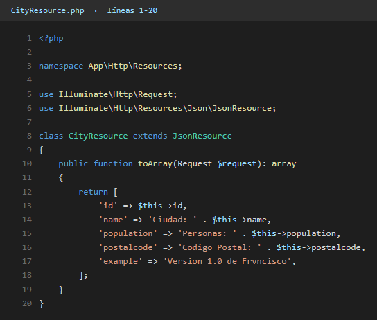

### `CityController.php` (parte 1)

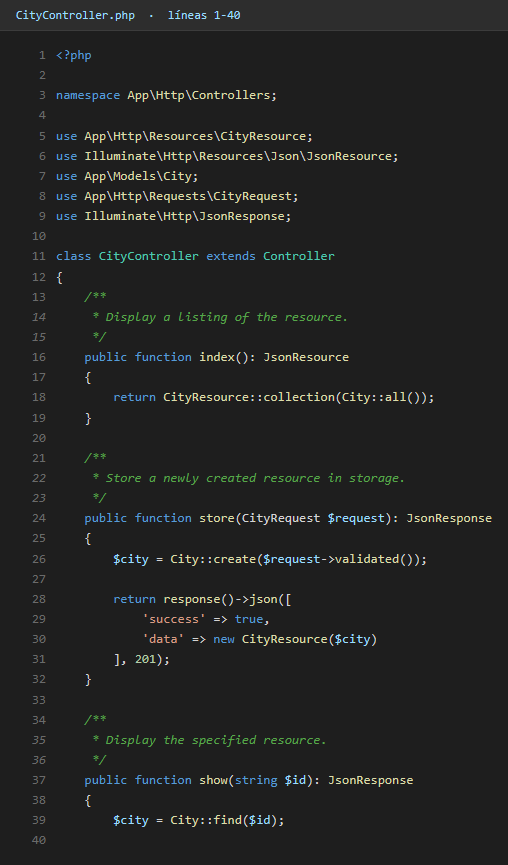

### `CityController.php` (parte 2)

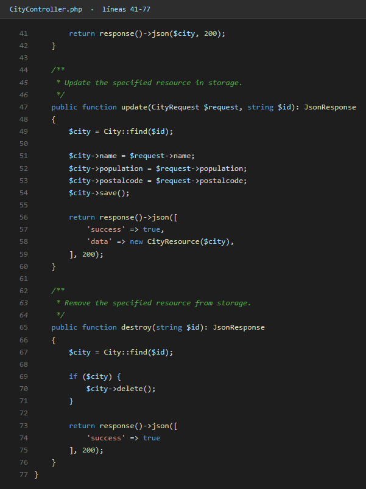

### `routes/api.php`

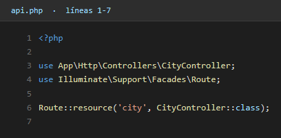
