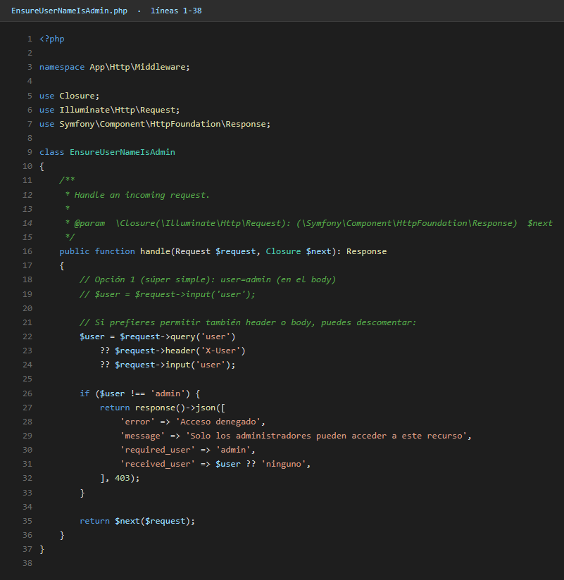
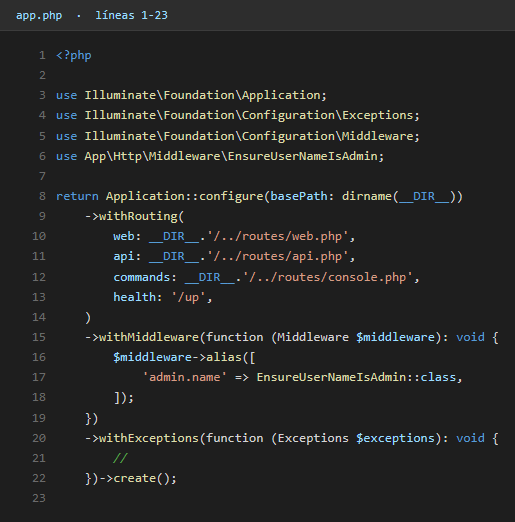
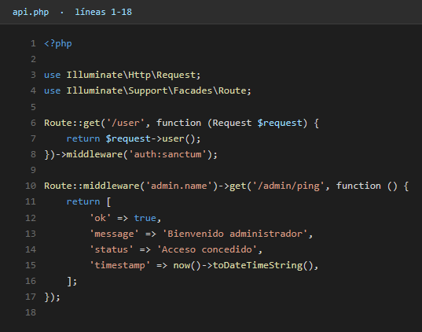

# Práctica 4.1 - Middleware Simple is Admin

## Objetivo
Proteger una ruta en `routes/api.php` comprobando que el usuario sea "admin".

- Si `user === "admin"` → **200 OK** (Pasa)
- Si no → **403 Forbidden** (Bloquea)

**Nota:** En este enfoque no existe un modelo User real (no hay usuario autenticado). Solo se valida un string enviado por el cliente.

---

## 📋 Pasos de Implementación

### 1. Crear el proyecto e instalar API
```bash
composer create-project laravel/laravel middleware1
cd middleware1
php artisan install:api
```

### 2. Crear el Middleware
```bash
php artisan make:middleware EnsureUserNameIsAdmin
```

Se creará el archivo: `app/Http/Middleware/EnsureUserNameIsAdmin.php`

### 3. Implementar la lógica del Middleware

El middleware verifica el parámetro `user` en:
- Query string (`?user=admin`)
- Header (`X-User: admin`)
- Body JSON (`{"user": "admin"}`)

**Código implementado:**
```php
public function handle(Request $request, Closure $next): Response
{
    $user = $request->query('user')
        ?? $request->header('X-User')
        ?? $request->input('user');

    if ($user !== 'admin') {
        return response()->json([
            'error' => 'Acceso denegado',
            'message' => 'Solo los administradores pueden acceder a este recurso',
            'required_user' => 'admin',
            'received_user' => $user ?? 'ninguno',
        ], 403);
    }

    return $next($request);
}
```

### 4. Registrar el middleware con alias

En `bootstrap/app.php`:
```php
use App\Http\Middleware\EnsureUserNameIsAdmin;

->withMiddleware(function (Middleware $middleware): void {
    $middleware->alias([
        'admin.name' => EnsureUserNameIsAdmin::class,
    ]);
})
```

### 5. Proteger la ruta en `routes/api.php`

```php
Route::middleware('admin.name')->get('/admin/ping', function () {
    return [
        'ok' => true,
        'message' => 'Bienvenido administrador',
        'status' => 'Acceso concedido',
        'timestamp' => now()->toDateTimeString(),
    ];
});
```

---

## 🧪 Pruebas

### ✅ Casos que PASAN (200 OK)

#### 1. Usando Query String
```bash
GET http://localhost:8000/api/admin/ping?user=admin
```

**Respuesta:**
```json
{
    "ok": true,
    "message": "Bienvenido administrador",
    "status": "Acceso concedido",
    "timestamp": "2026-02-06 13:45:30"
}
```

#### 2. Usando Header
```bash
GET http://localhost:8000/api/admin/ping
X-User: admin
```

**Respuesta:**
```json
{
    "ok": true,
    "message": "Bienvenido administrador",
    "status": "Acceso concedido",
    "timestamp": "2026-02-06 13:45:30"
}
```

#### 3. Usando Body JSON
```bash
POST http://localhost:8000/api/admin/ping
Content-Type: application/json

{
    "user": "admin"
}
```

**Respuesta:**
```json
{
    "ok": true,
    "message": "Bienvenido administrador",
    "status": "Acceso concedido",
    "timestamp": "2026-02-06 13:45:30"
}
```

---

### ❌ Casos que BLOQUEAN (403 Forbidden)

#### 1. Usuario incorrecto por Query String
```bash
GET http://localhost:8000/api/admin/ping?user=pepe
```

**Respuesta:**
```json
{
    "error": "Acceso denegado",
    "message": "Solo los administradores pueden acceder a este recurso",
    "required_user": "admin",
    "received_user": "pepe"
}
```

#### 2. Sin parámetro user
```bash
GET http://localhost:8000/api/admin/ping
```

**Respuesta:**
```json
{
    "error": "Acceso denegado",
    "message": "Solo los administradores pueden acceder a este recurso",
    "required_user": "admin",
    "received_user": "ninguno"
}
```

#### 3. Usuario incorrecto en Body
```bash
POST http://localhost:8000/api/admin/ping
Content-Type: application/json

{
    "user": "juan"
}
```

**Respuesta:**
```json
{
    "error": "Acceso denegado",
    "message": "Solo los administradores pueden acceder a este recurso",
    "required_user": "admin",
    "received_user": "juan"
}
```

---

## 🚀 Iniciar el servidor

```bash
php artisan serve
```

El servidor estará disponible en: `http://localhost:8000`

---

## 💡 Personalización

### Cambiar el usuario permitido

En `app/Http/Middleware/EnsureUserNameIsAdmin.php`, línea 19:
```php
if ($user !== 'superadmin') {  // Cambia 'admin' por el valor que quieras
```

### Cambiar los mensajes

**Mensaje de error (403):**
```php
return response()->json([
    'error' => 'Tu mensaje de error personalizado',
    'message' => 'Descripción detallada',
], 403);
```

**Mensaje de éxito (200):**

En `routes/api.php`:
```php
return [
    'ok' => true,
    'message' => 'Tu mensaje personalizado',
];
```

---

## 📁 Estructura de Archivos Clave

```
middleware1/
├── app/
│   └── Http/
│       └── Middleware/
│           └── EnsureUserNameIsAdmin.php  ← Lógica del middleware
├── bootstrap/
│   └── app.php                             ← Registro del middleware
├── routes/
│   └── api.php                             ← Ruta protegida
└── README.md                               ← Este archivo
```

---

## ✨ Características Implementadas

- ✅ Middleware simple para validación de usuario
- ✅ Soporte para query string, headers y body JSON
- ✅ Mensajes personalizados en español
- ✅ Respuestas JSON detalladas
- ✅ Código 403 para accesos denegados
- ✅ Timestamp en respuestas exitosas
- ✅ Información del usuario recibido en errores

---

## 🎓 Autor

**Francisco Pérez**  
DWES - UD7 - Middleware Laravel

---

## Código

### Middleware `EnsureUserNameIsAdmin.php`



### Registro del alias en `bootstrap/app.php`



### Ruta protegida en `routes/api.php`



