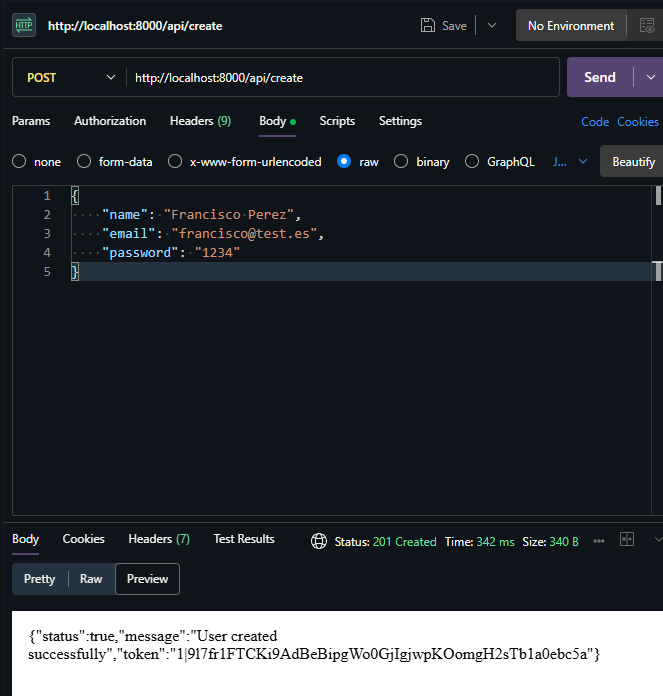
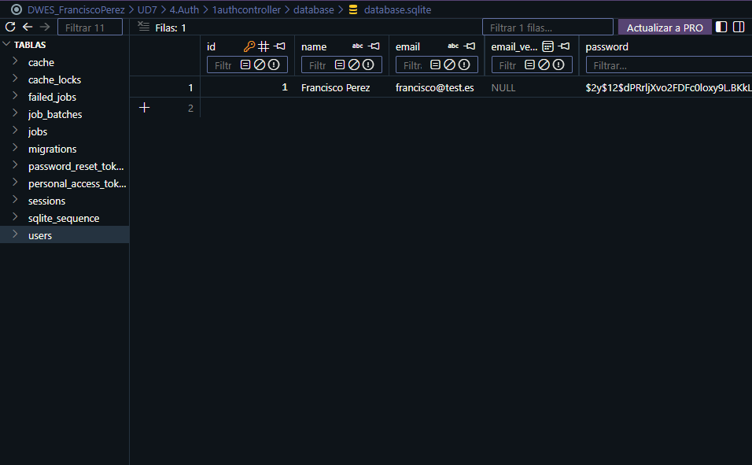
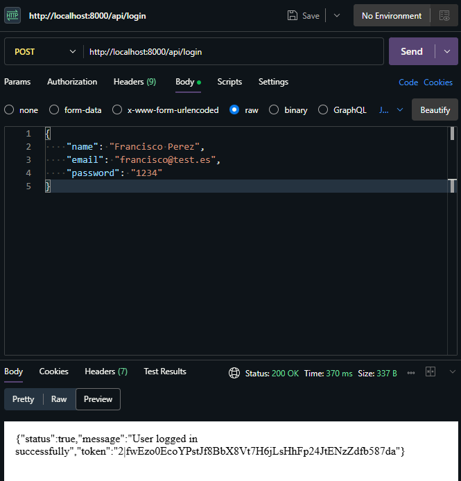
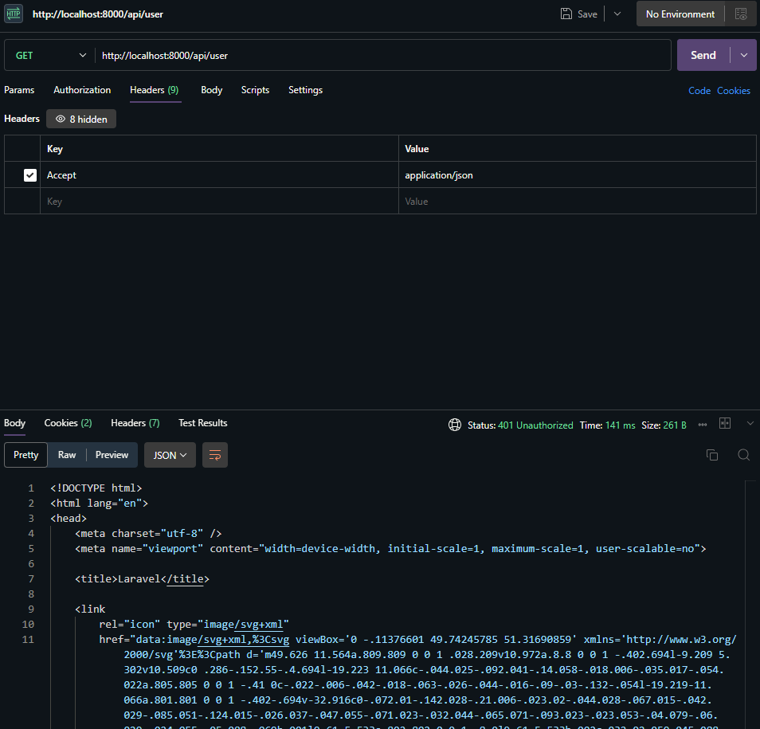
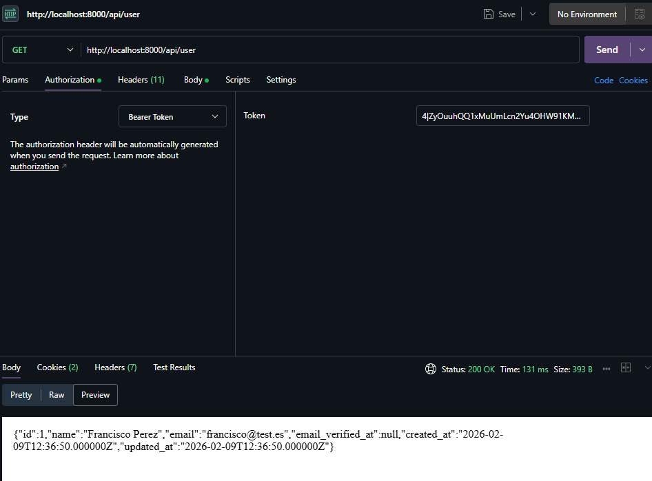
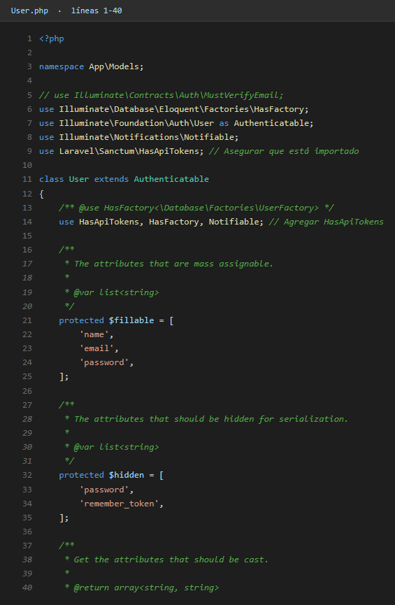
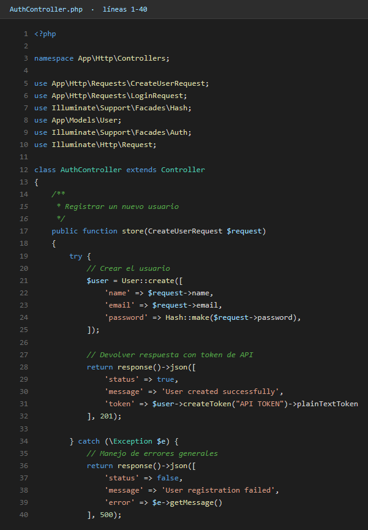
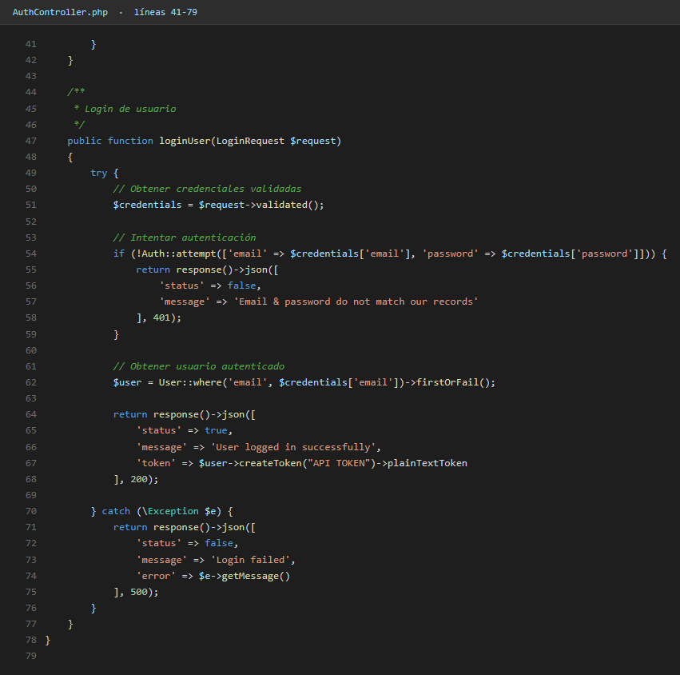
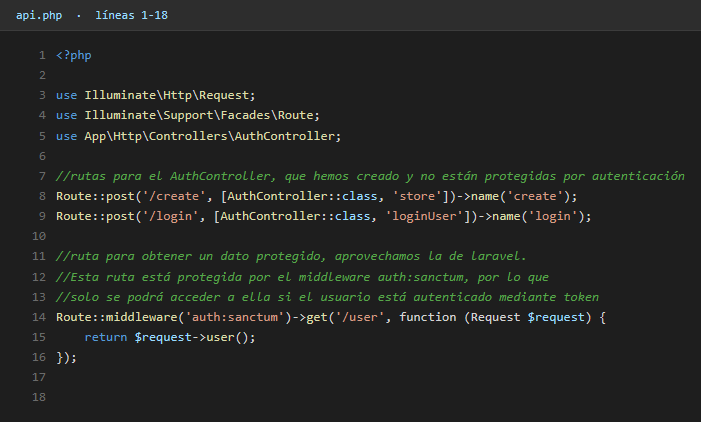

# AuthController con Laravel Sanctum

**Alumno:** Francisco Pérez Ruiz

---

## Introducción

Este es el primer proyecto del apartado de **autenticación**. La idea es montar el flujo más típico de una API moderna: registro, login y consulta de usuario autenticado mediante un **token Bearer**.

Para todo esto se usa **Laravel Sanctum**, que es el paquete oficial de Laravel para autenticación por tokens. Funciona así:

1. El usuario se registra con `POST /api/register` y recibe un token.
2. O bien hace login con `POST /api/login` y recibe un token.
3. Para acceder a las rutas protegidas (`/api/user`, por ejemplo) tiene que mandar ese token en el header `Authorization: Bearer <token>`.
4. Si no manda el token, o el token es inválido, Sanctum devuelve `401 Unauthorized`.

---

## Pasos que seguí

### 1. Crear el AuthController

Para no mezclar la lógica de autenticación con otros controladores, creo uno específico:

```bash
php artisan make:controller AuthController
```

Dentro del controlador definí tres métodos: `register`, `login` y `logout`.

### 2. Register

El método `register` recibe `name`, `email` y `password`, valida los campos, crea el usuario con la contraseña hasheada y devuelve un token nuevo.

```php
$user = User::create([
    'name'     => $request->name,
    'email'    => $request->email,
    'password' => bcrypt($request->password),
]);

$token = $user->createToken('auth_token')->plainTextToken;
return response()->json(['token' => $token]);
```

Captura del registro funcionando en Thunder Client:



Estado de la base de datos después del POST (la tabla `users` ya tiene el nuevo registro):



### 3. Login

El login comprueba que `email` y `password` coincidan con un usuario existente. Si todo cuadra, devuelve un token nuevo:

```php
if (!Auth::attempt($request->only('email', 'password'))) {
    return response()->json(['message' => 'Credenciales incorrectas'], 401);
}

$user  = User::where('email', $request->email)->first();
$token = $user->createToken('auth_token')->plainTextToken;
```

Captura del login funcionando:



### 4. Ruta protegida `/api/user`

En `routes/api.php` se define la ruta para obtener el usuario autenticado, protegida con el middleware `auth:sanctum`:

```php
Route::middleware('auth:sanctum')->get('/user', function (Request $request) {
    return $request->user();
});
```

### 5. Probar la protección

Si intento entrar a `/api/user` **sin token**, Sanctum me devuelve `401 Unauthorized`:



Y si mando el token correcto en el header `Authorization: Bearer <token>`, sí me devuelve la información del usuario:



---

## Lo que aprendí

- Sanctum simplifica muchísimo la autenticación por tokens. Con `createToken()` ya tienes un token listo, y con `auth:sanctum` proteges cualquier ruta.
- Los tokens se guardan en la tabla `personal_access_tokens` (que se creó al ejecutar `php artisan install:api`).
- El error `401 Unauthorized` cuando no se manda el token (o se manda mal) es la respuesta correcta de Sanctum.
- Para usar tokens hay que añadir el trait `HasApiTokens` al modelo `User`. Sin eso, `createToken` no existe.

Este es el flujo base que después se reutiliza en el proyecto `crud-venues` con un CRUD completo encima.

---

## Código

### Modelo `User.php` (con `HasApiTokens`)



### `AuthController.php` - register



### `AuthController.php` - login y logout



### `routes/api.php`


