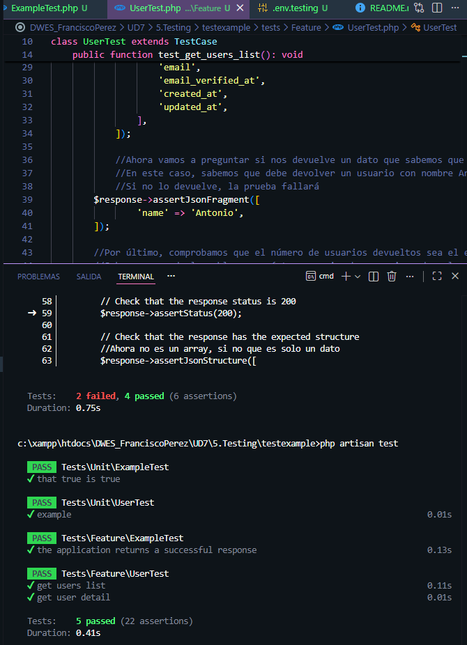
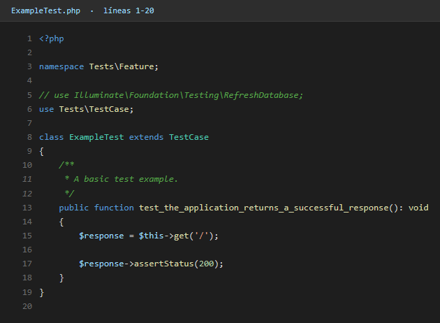
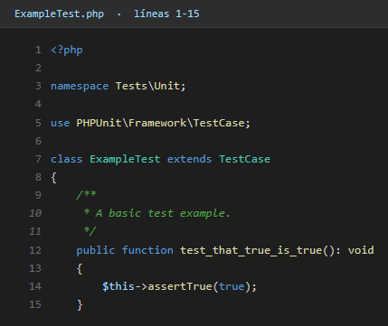

# Testing con PHPUnit en Laravel

**Alumno:** Francisco Pérez Ruiz

---

## Introducción

Este es el último proyecto de la unidad y va sobre **testing automatizado** en Laravel. Hasta ahora, cada vez que cambiaba algo en una API, tenía que abrir Thunder Client y probarlo a mano. Eso funciona cuando hay 2 o 3 endpoints, pero con muchos cambios se vuelve insostenible.

Laravel viene con **PHPUnit** integrado de serie y separa los tests en dos carpetas:

- `tests/Unit/` para pruebas pequeñas, en aislamiento (funciones, clases sueltas, helpers...).
- `tests/Feature/` para pruebas de "extremo a extremo" que hacen peticiones HTTP simuladas a la app.

---

## Comandos básicos

```bash
php artisan test                    # Ejecuta TODOS los tests
php artisan test --filter=Example   # Ejecuta solo los que coincidan
php artisan make:test ExampleTest   # Crea un test en tests/Feature/
php artisan make:test ExampleTest --unit  # Crea un test en tests/Unit/
```

---

## Ejemplo de test

Un test unitario típico en Laravel se ve así:

```php
public function test_dos_mas_dos_son_cuatro(): void
{
    $this->assertSame(4, 2 + 2);
}
```

Y un feature test que prueba un endpoint sería algo como:

```php
public function test_index_devuelve_200(): void
{
    $response = $this->get('/api/note');

    $response->assertStatus(200);
    $response->assertJsonStructure(['data']);
}
```

La gracia es que con `$this->get(...)`, `$this->post(...)`, etc., Laravel hace peticiones internas a la propia aplicación sin necesidad de levantar el servidor.

---

## Ejecución

Al lanzar `php artisan test` se ejecutan todos los tests y se ve un resumen verde/rojo con cada caso. Mientras los tests están en verde, significa que la aplicación se comporta como espero.



---

## Lo que aprendí

- Los tests no son opcionales si quieres tocar código con tranquilidad. Cuando ya hay 10 endpoints, asegurarse de que un cambio no rompe nada manualmente es inviable.
- Diferenciar **Unit** y **Feature** ayuda a mantener el orden: unit para "trozos pequeños", feature para "comportamiento completo".
- Con `assertStatus`, `assertJson`, `assertJsonStructure` se puede comprobar prácticamente cualquier cosa que devuelva una API.
- Para tests que necesitan base de datos, Laravel ofrece el trait `RefreshDatabase`, que limpia y vuelve a migrar entre tests para evitar interferencias.

Este apartado deja claro que **el testing es la parte que cierra el ciclo**: ya no hago una API, la pruebo a mano y la doy por buena, sino que dejo escritos los tests que demuestran que funciona.

---

## Código

### Feature test (`tests/Feature/ExampleTest.php`)



### Unit test (`tests/Unit/ExampleTest.php`)


